---
## Front matter
lang: ru-RU
title: Лабораторная работа №1
subtitle: Операционные системы
author:
  - Румянцев Артём Олегович
institute:
  - Российский университет дружбы народов, Москва, Россия
date: 2 марта 2023

## i18n babel
babel-lang: russian
babel-otherlangs: english

## Formatting pdf
toc: false
toc-title: Содержание
slide_level: 2
aspectratio: 169
section-titles: true
theme: metropolis
header-includes:
 - \metroset{progressbar=frametitle,sectionpage=progressbar,numbering=fraction}
 - '\makeatletter'
 - '\beamer@ignorenonframefalse'
 - '\makeatother'
---

# Цель работы

Целью данной работы является приобретение практических навыков установки операционной системы на виртуальную машину, 
настройки минимально необходимых для дальнейшей работы сервисов.

# Задание

1.Создание виртуальной машины
2.Установка операционной системы
3.Работа с операционной системой после установки
4.Установка программного обеспечения для создания документации
5.Дополнительноые задания

# Выполнение лабораторной работы

## Создание виртуальной машины

VirtualBox я устанавливал и настраивал при выполнении лабораторной работы на курсе "Архитектура компьютера",
поэтому сразу открываю окно приложения (рис. 1).

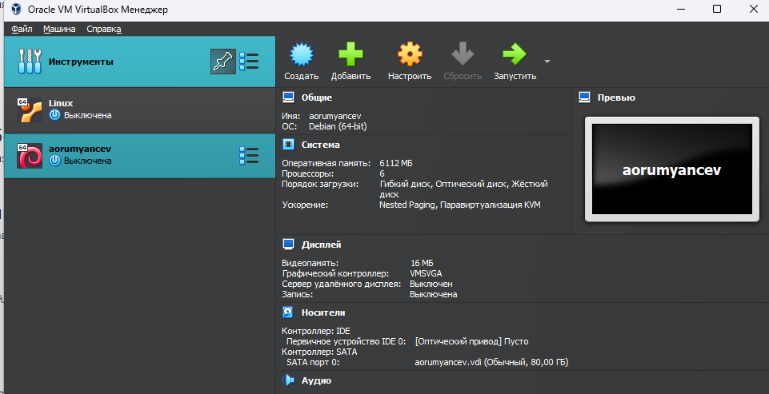{#fig:001 width=70%}

Нажимая "создать", создаю новую виртуальную машину, указываю её имя, 
путь к папке машины по умолчанию меня устравивает,выбираю тип ОС и версию
(рис. 2 ).

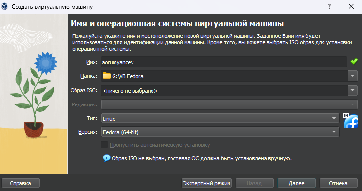{#fig:001 width=70%}

Указываю объем оперативной памяти виртуальной машины размером 6112 МБ и отдаю 6 виртуальных процессора(рис. 3).

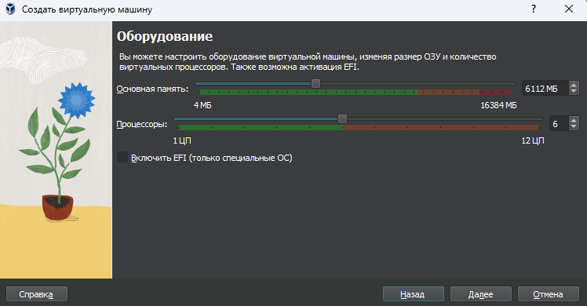{#fig:001 width=70%}

Выбираю создание нового виртуального жесткого диска и 
выделяю ему память 80 гб(рис. 4).

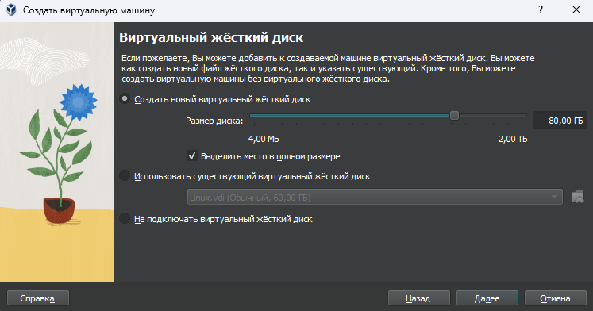{#fig:001 width=70%}

Создание носителя (рис. 5 ). 

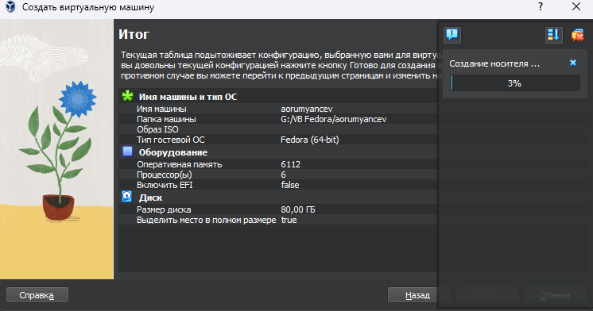{#fig:001 width=70%}

Выбираю в Virtualbox настройку своей виртуальной машины. Перехожу в "Носители", добавляю новый привод оптическх дисокв 
и выбираю скачанный образ операционной системы Fedora (рис. 6 ).

{#fig:001 width=70%}

Скачанный образ ОС был успешно выбран (рис. 7 ).

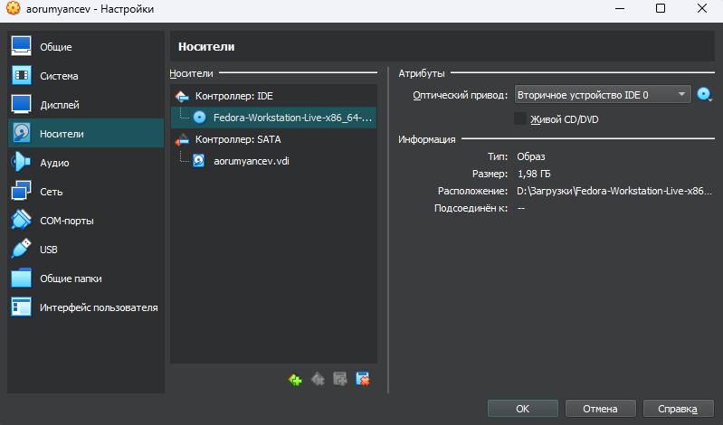{#fig:001 width=70%}

## Установка операционной системы 

Запускаю созданную виртуальную машину для установки (рис. 8 ).

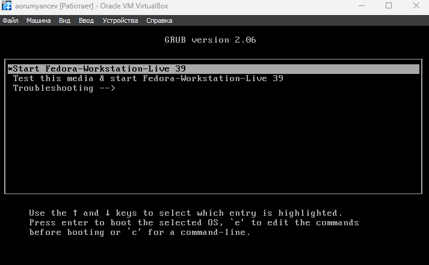{#fig:001 width=70%}

Открываю терминал и ввожу команду liveinst (рис. 9 ).

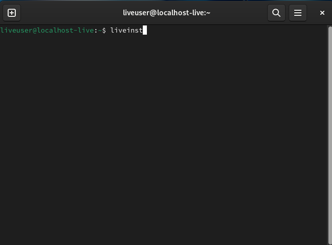{#fig:001 width=70%}

Выбираю язык для использования в процессе установки русский (рис. 10 ).

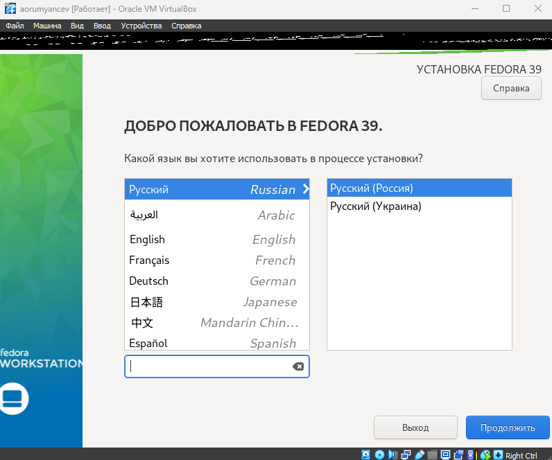{#fig:001 width=70%}

Проверяю место установки значение по умолчанию (рис. 11 ).

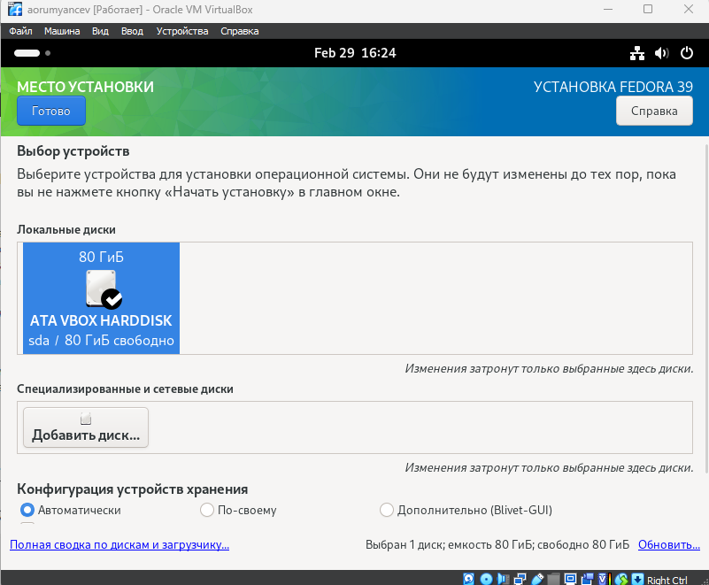{#fig:001 width=70%}

Выбираю раскладку клавиатуры русскую и английскую (рис. 12 ).

{#fig:001 width=70%}

Корректирую часовый пояс,чтобы время совпадало с моим регионом (рис. 13 ).

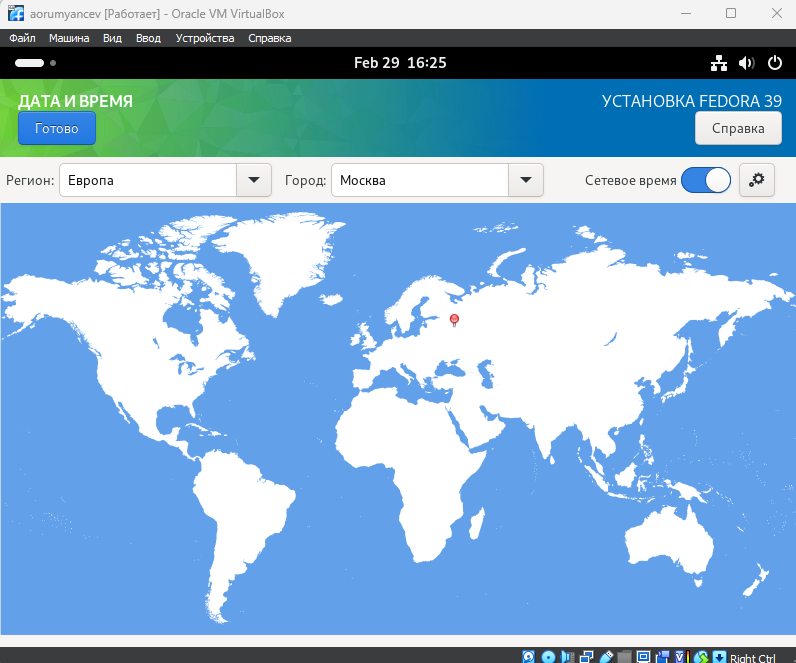{#fig:001 width=70%}

Даллее операционная система устанавливается. После установки "завершить установку"(рис. 14 ).

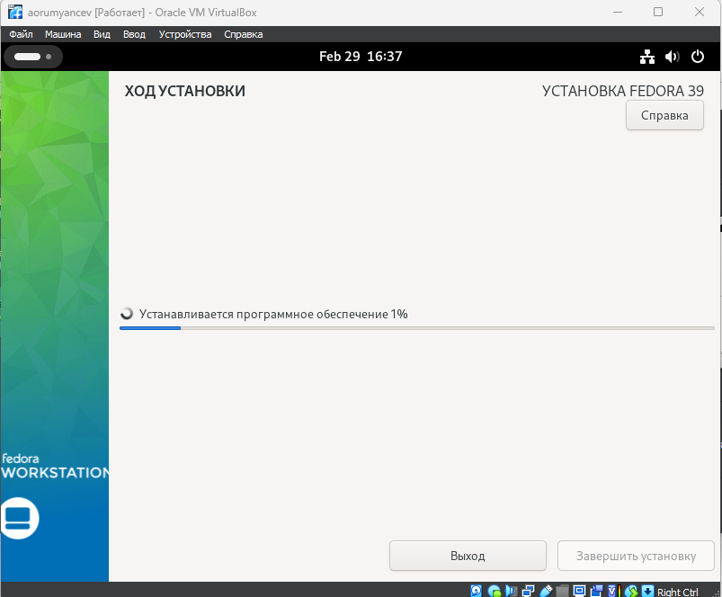{#fig:001 width=70%}

Диск не отключился автоматически, поэтому отключаю носитель информации с образом (рис. 15 ).

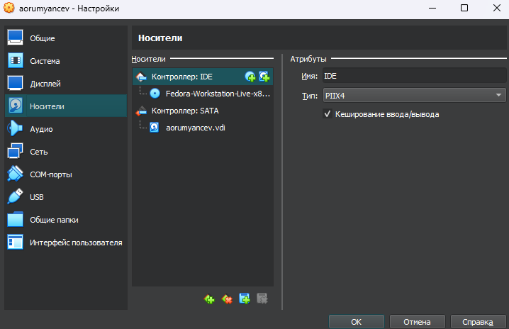{#fig:001 width=70%}

Носитель иформации с образом отключен (рис. 16 ).

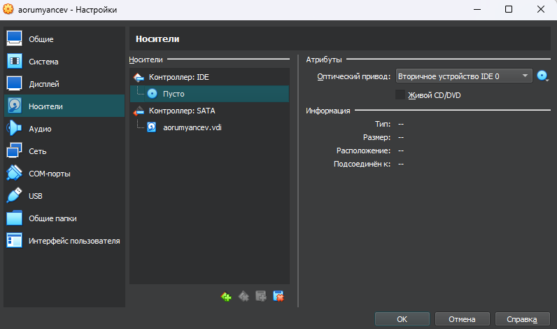{#fig:001 width=70%}

## Работа с операционной системой после установки 

Запускаю виртаульную машину. Ввожу свои инициалы и фамилию (рис. 17 ).

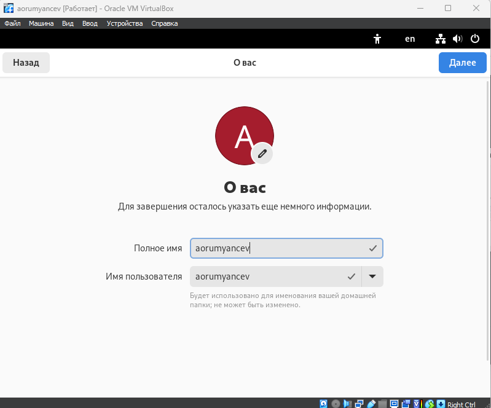{#fig:001 width=70%}

Запускаю терминал и переключаюсь на роль супер-пользователя (рис. 18 ).

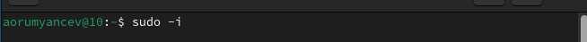{#fig:001 width=70%}

Обновляю все пакеты (рис. 19 ).

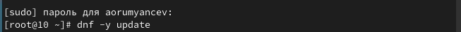{#fig:001 width=70%}

Устанавлию программы для удобства работы в консоли:tmux для открытия нескольких "вкладок" в одном терминале, 
mc в качестве файлового менеджера в терминалее (рис. 20).

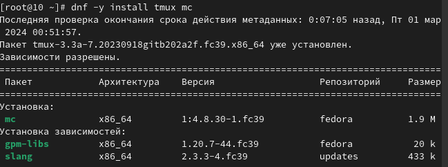{#fig:001 width=70%}

Устанавливаю программы для автоматического обновления (рис. 21 ).

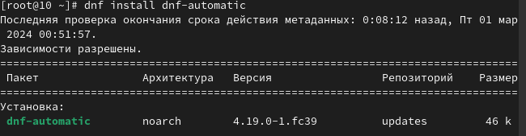{#fig:001 width=70%}

Запускаю таймер (рис. 22 ).

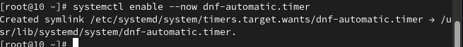{#fig:001 width=70%}

Перемещаюсь в директорию /etc/selinux,открываю md,ищу нужный файл и редактирую его, 
заменяю SELINUX=enforcing на SElinux=permissive и перезапускаю машину командой reboot(рис. 23).

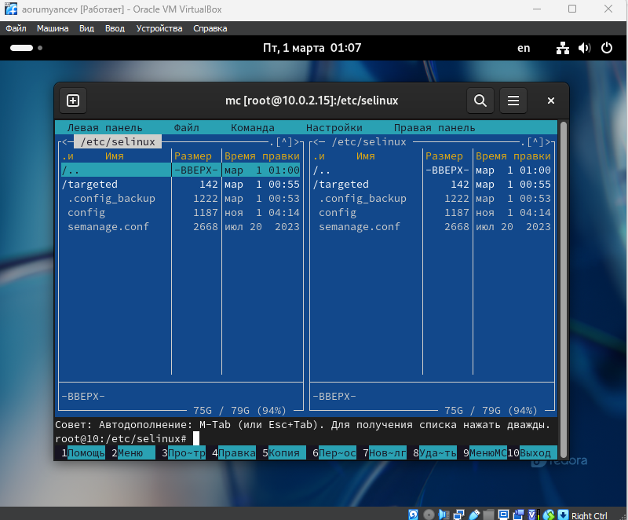{#fig:001 width=70%}

{#fig:001 width=70%}

Снова вхожу в ОС,снова запускаю терминал, запускаю терминальный мультплексор tmux (рис. 24 ).

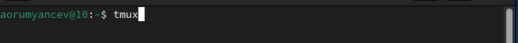{#fig:001 width=70%}

Переключаюсь на роль суперпользователя (рис. 25 ).

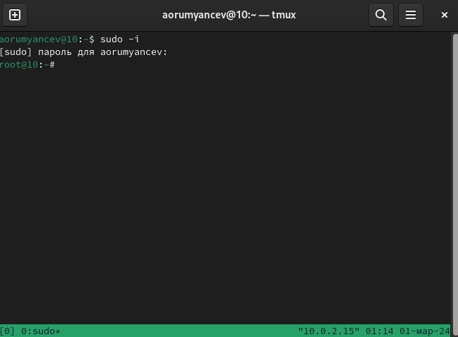{#fig:001 width=70%}

Устанавливаю средства разарботки (рис. 26 ). 

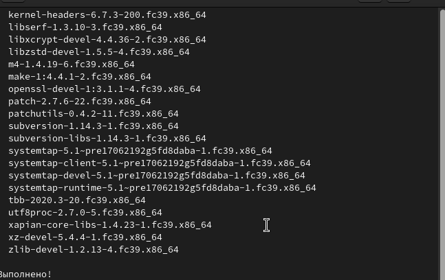{#fig:001 width=70%}

Устанавливаю пакет DKMS (рис. 27 ).

{#fig:001 width=70%}

В меню виртуальной машины подключаю образ дска гостевой ОС
и примонтирую диск с помощью утилиты mount (рис. 28 ).

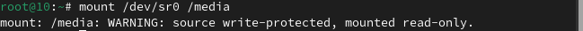{#fig:001 width=70%}

Перезагружаю виртуальную машину (рис. 29 ).

{#fig:001 width=70%}

Перехожу в директорию /tc/X11/xorg.conf.d, открываю mc для убоства,открываю файл 00-keyboard.conf (рис. 30 ).

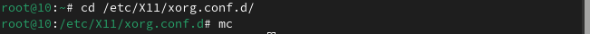{#fig:001 width=70%}

Редакатирую конфигурационный файл (рис. 31).

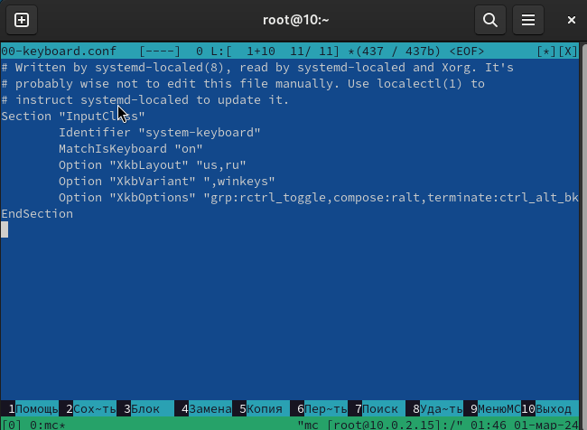{#fig:001 width=70%}

Перезагружаю ОС (рис. 32 ).

{#fig:001 width=70%}

## Установка программного обеспечения для создания документации 

Запускаю терминал. Запускаю терминальный мультиплексор tmux,
переключаюсь на роль супер-пользователя и устанвалию pandoc (рис. 33 ).

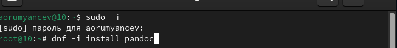{#fig:001 width=70%}
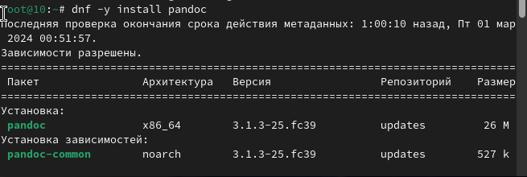{#fig:001 width=70%}

Устанавливаю необходимые расширения для pandoc (рис. 34 ).

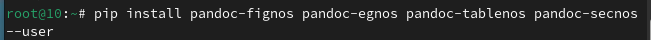{#fig:001 width=70%}

Устанавливаю дистрибутив texlive (рис. 35).

{#fig:001 width=70%}

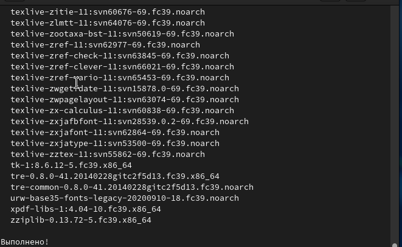{#fig:001 width=70%}

# Выводы

При выполнении данной лабораторной работы, я приобрел практические навыки установки операционной системы на виртуальную машину,
а так же сделал настройки минимально необходимых для дальнейшей работы сервисов.

