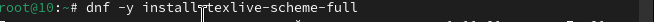

---
## Front matter
title: "Лабораторная работа №1"
subtitle: "Архитектура компьютера и операционные системы"
author: "Румянцев Артём Олегович"

## Generic otions
lang: ru-RU
toc-title: "Содержание"

## Bibliography
bibliography: bib/cite.bib
csl: pandoc/csl/gost-r-7-0-5-2008-numeric.csl

## Pdf output format
toc: true # Table of contents
toc-depth: 2
lof: true # List of figures
lot: true # List of tables
fontsize: 12pt
linestretch: 1.5
papersize: a4
documentclass: scrreprt
## I18n polyglossia
polyglossia-lang:
  name: russian
  options:
	- spelling=modern
	- babelshorthands=true
polyglossia-otherlangs:
  name: english
## I18n babel
babel-lang: russian
babel-otherlangs: english
## Fonts
mainfont: PT Serif
romanfont: PT Serif
sansfont: PT Sans
monofont: PT Mono
mainfontoptions: Ligatures=TeX
romanfontoptions: Ligatures=TeX
sansfontoptions: Ligatures=TeX,Scale=MatchLowercase
monofontoptions: Scale=MatchLowercase,Scale=0.9
## Biblatex
biblatex: true
biblio-style: "gost-numeric"
biblatexoptions:
  - parentracker=true
  - backend=biber
  - hyperref=auto
  - language=auto
  - autolang=other*
  - citestyle=gost-numeric
## Pandoc-crossref LaTeX customization
figureTitle: "Рис."
tableTitle: "Таблица"
listingTitle: "Листинг"
lofTitle: "Список иллюстраций"
lotTitle: "Список таблиц"
lolTitle: "Листинги"
## Misc options
indent: true
header-includes:
  - \PassOptionsToPackage{english,russian}{babel}
  - \usepackage[english,russian]{babel}
  - \usepackage[utf8]{inputenc}
  - \usepackage{indentfirst}
  - \usepackage{float} # keep figures where there are in the text
  - \floatplacement{figure}{H} # keep figures where there are in the text
---
# Цель работы

Целью данной работы является приобретение практических навыков установки операционной системы на виртуальную машину, 
настройки минимально необходимых для дальнейшей работы сервисов.

# Задание

1.Создание виртуальной машины
2.Установка операционной системы
3.Работа с операционной системой после установки
4.Установка программного обеспечения для создания документации
5.Дополнительноые задания

# Выполнение лабораторной работы

## Создание виртуальной машины

VirtualBox я устанавливал и настраивал при выполнении лабораторной работы на курсе "Архитектура компьютера",
поэтому сразу открываю окно приложения (рис. 1).

{#fig:001 width=70%}

Нажимая "создать", создаю новую виртуальную машину, указываю её имя, 
путь к папке машины по умолчанию меня устравивает,выбираю тип ОС и версию
(рис. 2 ).

{#fig:001 width=70%}

Указываю объем оперативной памяти виртуальной машины размером 6112 МБ и отдаю 6 виртуальных процессора(рис. 3).

{#fig:001 width=70%}

Выбираю создание нового виртуального жесткого диска и 
выделяю ему память 80 гб(рис. 4).

{#fig:001 width=70%}

Создание носителя (рис. 5 ). 

{#fig:001 width=70%}

Выбираю в Virtualbox настройку своей виртуальной машины. Перехожу в "Носители", добавляю новый привод оптическх дисокв 
и выбираю скачанный образ операционной системы Fedora (рис. 6 ).

{#fig:001 width=70%}

Скачанный образ ОС был успешно выбран (рис. 7 ).

{#fig:001 width=70%}

## Установка операционной системы 

Запускаю созданную виртуальную машину для установки (рис. 8 ).

{#fig:001 width=70%}

Открываю терминал и ввожу команду liveinst (рис. 9 ).

{#fig:001 width=70%}

Выбираю язык для использования в процессе установки русский (рис. 10 ).

{#fig:001 width=70%}

Проверяю место установки значение по умолчанию (рис. 11 ).

{#fig:001 width=70%}

Выбираю раскладку клавиатуры русскую и английскую (рис. 12 ).

{#fig:001 width=70%}

Корректирую часовый пояс,чтобы время совпадало с моим регионом (рис. 13 ).

{#fig:001 width=70%}

Даллее операционная система устанавливается. После установки "завершить установку"(рис. 14 ).

{#fig:001 width=70%}

Диск не отключился автоматически, поэтому отключаю носитель информации с образом (рис. 15 ).

{#fig:001 width=70%}

Носитель иформации с образом отключен (рис. 16 ).

{#fig:001 width=70%}

## Работа с операционной системой после установки 

Запускаю виртаульную машину. Ввожу свои инициалы и фамилию (рис. 17 ).

{#fig:001 width=70%}

Запускаю терминал и переключаюсь на роль супер-пользователя (рис. 18 ).

{#fig:001 width=70%}

Обновляю все пакеты (рис. 19 ).

{#fig:001 width=70%}

Устанавлию программы для удобства работы в консоли:tmux для открытия нескольких "вкладок" в одном терминале, 
mc в качестве файлового менеджера в терминалее (рис. 20).

{#fig:001 width=70%}

Устанавливаю программы для автоматического обновления (рис. 21 ).

{#fig:001 width=70%}

Запускаю таймер (рис. 22 ).

{#fig:001 width=70%}

Перемещаюсь в директорию /etc/selinux,открываю md,ищу нужный файл и редактирую его, 
заменяю SELINUX=enforcing на SElinux=permissive и перезапускаю машину командой reboot(рис. 23).

{#fig:001 width=70%}

{#fig:001 width=70%}

Снова вхожу в ОС,снова запускаю терминал, запускаю терминальный мультплексор tmux (рис. 24 ).

{#fig:001 width=70%}

Переключаюсь на роль суперпользователя (рис. 25 ).

{#fig:001 width=70%}

Устанавливаю средства разарботки (рис. 26 ). 

{#fig:001 width=70%}

Устанавливаю пакет DKMS (рис. 27 ).

{#fig:001 width=70%}

В меню виртуальной машины подключаю образ дска гостевой ОС
и примонтирую диск с помощью утилиты mount (рис. 28 ).

{#fig:001 width=70%}

Перезагружаю виртуальную машину (рис. 29 ).

{#fig:001 width=70%}

Перехожу в директорию /tc/X11/xorg.conf.d, открываю mc для убоства,открываю файл 00-keyboard.conf (рис. 30 ).

{#fig:001 width=70%}

Редакатирую конфигурационный файл (рис. 31).

{#fig:001 width=70%}

Перезагружаю ОС (рис. 32 ).

{#fig:001 width=70%}

## Установка программного обеспечения для создания документации 

Запускаю терминал. Запускаю терминальный мультиплексор tmux,
переключаюсь на роль супер-пользователя и устанвалию pandoc (рис. 33 ).

{#fig:001 width=70%}
{#fig:001 width=70%}

Устанавливаю необходимые расширения для pandoc (рис. 34 ).

{#fig:001 width=70%}

Устанавливаю дистрибутив texlive (рис. 35).

{#fig:001 width=70%}

{#fig:001 width=70%}

# Выводы

При выполнении данной лабораторной работы, я приобрел практические навыки установки операционной системы на виртуальную машину,
а так же сделал настройки минимально необходимых для дальнейшей работы сервисов.

# Ответы на контрольные вопросы 

1.Учетная запись содержит необходимые для идентификации пользователя при подключении к системе данные, 
а так же информацию для авторизации и учета: системного имени (user name) (оно может содержать только латинские буквы и знак нижнее подчеркивание, еще оно должно быть уникальным), 
идентификатор пользователя (UID) (уникальный идентификатор пользователя в системе, 
целое положительное число), идентификатор группы (CID) (группа, к к-рой относится пользователь. Она, как минимум, одна, по умолчанию - одна), 
полное имя (full name) (Могут быть ФИО), 
домашний каталог (home directory) (каталог, в к-рый попадает пользователь после входа в систему и в к-ром хранятся его данные),
 начальная оболочка (login shell) (командная оболочка, к-рая запускается при входе в систему).

2.Для получения справки по команде: <команда> --help; для перемещения по файловой системе - cd; для просмотра содержимого каталога - ls;
 для определения объёма каталога - du <имя каталога>; для создания / удаления каталогов - mkdir/rmdir; для создания / удаления файлов - touch/rm; 
для задания определённых прав на файл / каталог - chmod; для просмотра истории команд - history

3.Файловая система - это порядок, определяющий способ организации и хранения и именования данных на различных носителях информации. 
Примеры: FAT32 представляет собой пространство, разделенное на три части: олна область для служебных структур, 
форма указателей в виде таблиц и зона для хранения самих файлов. ext3/ext4 - журналируемая файловая система, используемая в основном в ОС с ядром Linux.

4.С помощью команды df, введя ее в терминале. Это утилита, которая показывает список всех файловых систем по именам устройств,
 сообщает их размер и данные о памяти. Также посмотреть подмонтированные файловые системы можно с помощью утилиты mount.

5.Чтобы удалить зависший процесс, вначале мы должны узнать, какой у него id: используем команду ps. Далее в терминале вводим команду kill < id процесса >. 
Или можно использовать утилиту killall, что "убьет" все процессы, которые есть в данный момент, для этого не нужно знать id процесса.

## Выполнение домашнего задания
Ввожу в терминале команду dmesg, чтобы проанализировать последовательность загрузки системы (рис. 36 ).

{#fig:001 width=70%}

С помощью поиска, осуществляемого командой 'dmesg | grep -i <что ищем>', ищу версию ядра Linux: 6.1.10-200.fc37.x86_64 (рис. 37]).

{#fig:001 width=70%}

К сожалению, если вводить "Detected Mhz processor" там, где нужно указывать, что я ищу, то мне ничего не выведется. Это происходит потому, что запрос не предусматривает дополнительные символы внутри него (я проверяла, будет ли работать он с маской - не будет). В таком случае я оставила одно из ключевых слов (могла оставить два: "Mhz processor") и получила результат: 1992 Mhz (рис. 38 ).

{#fig:001 width=70%}

Аналогично ищу модель процессора (рис. 39 ).

{#fig:001 width=70%}

Объем доступной оперативной памяти ищу аналогично поиску частоты процессора, т. к. возникла та же проблема, что и там рис. 40 ).

{#fig:001 width=70%}

Нахожу тип обнаруженного гипервизора (рис. 41 ).

{#fig:001 width=70%}

Тип файловой системы корневого раздела можно посмотреть с помощью утилиты fdisk (рис. 42 ).

{#fig:001 width=70%}

# Список литературы{.unnumbered}

::: {#refs}
:::
1.Dash P. Getting started with oracle vm virtualbox. Packt Publishing Ltd, 2013. 
2.Colvin H. Virtualbox: An ultimate guide book on virtualization with virtualbox. CreateSpace Independent Publishing Platform, 2015. .
van Vugt S. Red hat rhcsa/rhce 7 cert guide : Red hat enterprise linux 7 (ex200 and ex300). Pearson IT Certification, 2016. 
3.Робачевский А., Немнюгин С., Стесик О. Операционная система unix. 2-е изд. Санкт-Петербург: БХВ-Петербург, 2010. 
4.Немет Э. et al. Unix и Linux: руководство системного администратора. 4-е изд. Вильямс, 2014. 
5.Колисниченко Д.Н. Самоучитель системного администратора Linux. СПб.: БХВ-Петербург, 2011. 
6.Robbins A. Bash pocket reference. O’Reilly Media, 2016. 
