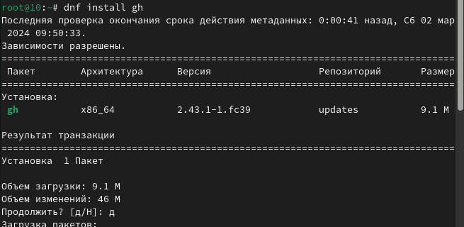
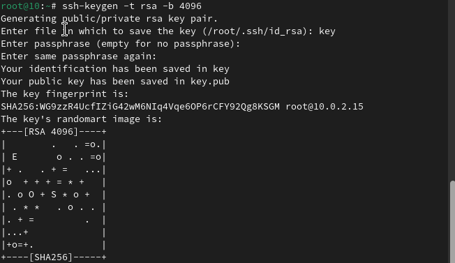
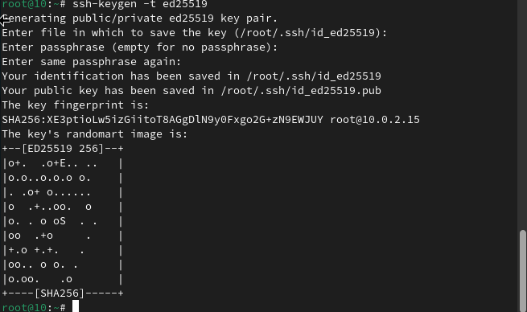
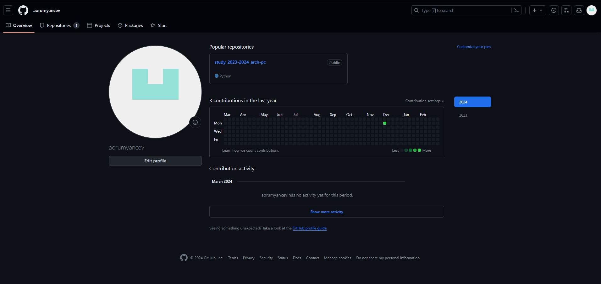
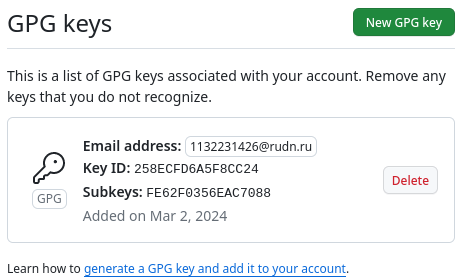

---
## Front matter
title: "Отчёт по лабораторной работе №2"
subtitle: "Дисциплина:Архитектура компьютеров и операционных систем"
author: "Румянцев Артём Олегович"

## Generic otions
lang: ru-RU
toc-title: "Содержание"

## Bibliography
bibliography: bib/cite.bib
csl: pandoc/csl/gost-r-7-0-5-2008-numeric.csl

## Pdf output format
toc: true # Table of contents
toc-depth: 2
lof: true # List of figures
lot: true # List of tables
fontsize: 12pt
linestretch: 1.5
papersize: a4
documentclass: scrreprt
## I18n polyglossia
polyglossia-lang:
  name: russian
  options:
	- spelling=modern
	- babelshorthands=true
polyglossia-otherlangs:
  name: english
## I18n babel
babel-lang: russian
babel-otherlangs: english
## Fonts
mainfont: PT Serif
romanfont: PT Serif
sansfont: PT Sans
monofont: PT Mono
mainfontoptions: Ligatures=TeX
romanfontoptions: Ligatures=TeX
sansfontoptions: Ligatures=TeX,Scale=MatchLowercase
monofontoptions: Scale=MatchLowercase,Scale=0.9
## Biblatex
biblatex: true
biblio-style: "gost-numeric"
biblatexoptions:
  - parentracker=true
  - backend=biber
  - hyperref=auto
  - language=auto
  - autolang=other*
  - citestyle=gost-numeric
## Pandoc-crossref LaTeX customization
figureTitle: "Рис."
tableTitle: "Таблица"
listingTitle: "Листинг"
lofTitle: "Список иллюстраций"
lotTitle: "Список таблиц"
lolTitle: "Листинги"
## Misc options
indent: true
header-includes:
  - \PassOptionsToPackage{english,russian}{babel}
  - \usepackage[english,russian]{babel}
  - \usepackage[utf8]{inputenc}
  - \usepackage{indentfirst}
  - \usepackage{float} # keep figures where there are in the text
  - \floatplacement{figure}{H} # keep figures where there are in the text
---

# Цель работы
Цель данной лабораторной работы -- изучение идеологии и применения средств контроля версий,
освоение умения по работе с git.

# Задание

1.Создать базовую конфигурацию для работы c git
2.Создать ключ SSH
3.Создать ключ GPG
4.Настроить подписи Git 
5.Зарегистрироваться на  GitHub
6.Создать локальный каталог для выполнения заданий по предмету
# Теоретическое введение

Основные команды git

Перечислим наиболее часто используемые команды git.

Создание основного дерева репозитория:

git init

Получение обновлений (изменений) текущего дерева из центрального репозитория:

git pull

    Отправка всех произведённых изменений локального дерева в центральный репозиторий:

git push

Просмотр списка изменённых файлов в текущей директории:

git status

Просмотр текущих изменений:

git diff

Сохранение текущих изменений:

добавить все изменённые и/или созданные файлы и/или каталоги:

git add .

добавить конкретные изменённые и/или созданные файлы и/или каталоги:

 git add имена_файлов

удалить файл и/или каталог из индекса репозитория (при этом файл и/или каталог остаётся в локальной директории):

git rm имена_файлов

    Сохранение добавленных изменений:

сохранить все добавленные изменения и все изменённые файлы:

git commit -am 'Описание коммита'

сохранить добавленные изменения с внесением комментария через встроенный редактор:

git commit
 новой ветки, базирующейся на текущей:

git checkout -b имя_ветки

        переключение на некоторую ветку:

git checkout имя_ветки

(при переключении на ветку, которой ещё нет в локальном репозитории, она будет создана и связана с удалённой)

отправка изменений конкретной ветки в центральный репозиторий:

git push origin имя_ветки

слияние ветки с текущим деревом:

git merge --no-ff имя_ветки

    Удаление ветки:

удаление локальной уже слитой с основным деревом ветки:

git branch -d имя_ветки

принудительное удаление локальной ветки:

git branch -D имя_ветки

удаление ветки с центрального репозитория:

git push origin :имя_ветки

# Выполнение лабораторной работы
## Установка программного обеспечения

Установка необходимого программного обеспечения git и gh через терминал с помощью команд:
 dnf install git и dnf install gh (рис.1).

{#fig:001 width=70%}

{#fig:002 width=70%}

## Базовая настройка git
Задаю в качестве имени и email владельца репозитория свои имя,фамилию и электронную почту(рис 2)

{#fig:002 width=70%}

Настраиваю utf-8 в выводе сообщений git дли их корректного отображения

{#fig:001 width=70%}

Начальной ветке задаю имя master 

{#fig:001 width=70%}

Задаю параметры autocrlf и  safecrlf для корректного отображения конца строки

{#fig:001 width=70%}

## Создание ключа SSH

Создаю ключ ssh размером 4096 бит по алгоритму rsa 

{#fig:001 width=70%}

Создаю ключ ssh по алгоритму ed 25519 

{#fig:001 width=70%}

## Создание Ключа GPG

Генерирую ключ GPG,затем выбираю тип ключа RSA and RSA, задаю макс. длину ключа;4096,оставляю неограниченный срок действия ключа. Далее отвечаю на вопросы программы о личной информации

{#fig:001 width=70%}

## Регистрация на GitHub

У меня уже был создан аккаунт на Github, соответственно, основные данные аккаунта я так же заполнил и проводил его настройку, поэтому просто вхожу в свой аккаунт 

{#fig:001 width=70%}

##  Добавление ключа GPG в GitHub

Вывожу список созданных ключей в терминал, ищу в результате запроса отпечаток ключа (последовательность байтов для идентификации более длинного, по сравнению с самим отпечатком, ключа), он стоит после знака слеша, копирую его в буфер обмена

{#fig:001 width=70%}

Ввожу в терминале команду,с помощью которой копирую сам ключ GPG в буфер обмена, за это отвечает утилита xclip.

{#fig:001 width=70%}

Открываю настройки GirHub, ищу среди них добавление GPG ключа.
Нажимаю на  New GPG key и вставляю в поле ключ из буфера обмена.
Я добавил ключ GPG на GitHub

{#fig:001 width=70%}

## Настроить подписи Git

Настраиваю автоматические подписи коммитов  git: используя введенный ранее email, указываю git использовать его при создании подписей коммитов.

{#fig:001 width=70%}

## Настройка gh

Начинаю авторизацию в gh, отвечаю на наводящие вопросы от утилиты, в конце выбираю авторизоваться через браузер

{#fig:001 width=70%}

Завершаю авторизацию на сайте 

{#fig:001 width=70%}

Вижу сообщение о завершении авторизации под именем aorumyancev

{#fig:001 width=70%}

## Создание репозитория курса на основе шаблона

Сначала создаю директорию с помощью утилиты mkdir и флага -p, кторый позволяет установить каталоги на всем указанном пути. После этого с помощью утилиты cd  перехожу в только что созданную директорию "Операционные системы". Далее в терминале ввожу команду gh repo create study_2023-2024_os-intro --template yamadharma/course-derctory-student-trmplate--public, чтобы создать репозиторий на основе шаблона репозитория. После этого клонирую репозиторий к себе в директорию, я указываю 
ссылку с протоколом https, а не ssh, потому что при авторизации в gh выбрала протокол https 

{#fig:001 width=70%}

Перехожу в каталог курса с помощью утилиты cd, проверяю содеражание катлога с помощью утилиты ls 

{#fig:001 width=70%}

Удаляю лишние файлы с помощью утилиты rm, далее создаю неободимые каталоги используя makefile 

{#fig:001 width=70%}

Добавляю все новые файлы для отправки на сервер(сохраняю добавленные изменения с помощью команды git add и комментирую их с помощью git commit

{#fig:001 width=70%}

Отправляю файлы на сервер с помощью git push.

{#fig:022 width=70%}

## Выводы

При выполнении данной лабораторной работы я изучил идеологию и применение средств контроля версий, освоил умение по работе с git.

