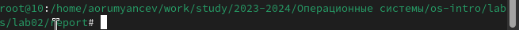
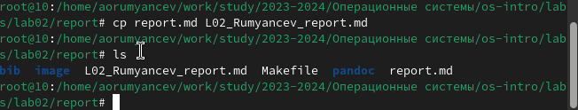
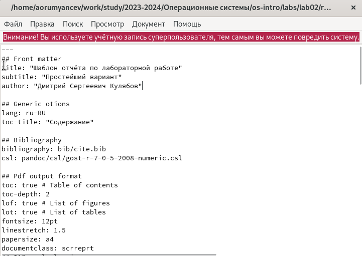
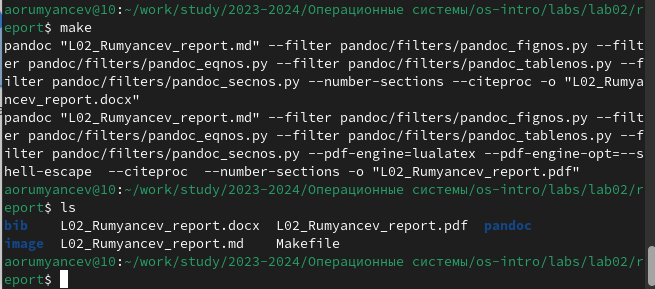
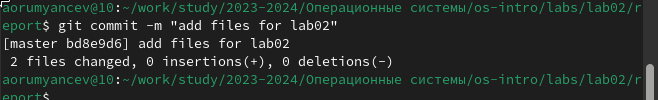
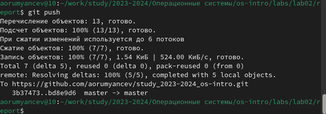

---
## Front matter
lang: ru-RU
title: Структура научной презентации
subtitle: Простейший шаблон
author:
  - Румянцев А.О.
institute:
  - Российский университет дружбы народов, Москва, Россия
date: 3 марта 2023

## i18n babel
babel-lang: russian
babel-otherlangs: english

## Formatting pdf
toc: false
toc-title: Содержание
slide_level: 2
aspectratio: 169
section-titles: true
theme: metropolis
header-includes:
 - \metroset{progressbar=frametitle,sectionpage=progressbar,numbering=fraction}
 - '\makeatletter'
 - '\beamer@ignorenonframefalse'
 - '\makeatother'
---

# Цель работы

Научиться оформлять отчёты с помощью легковесного языка разметки Markdown.

# Задание

1. Сделайте отчёт по предыдущей лабораторной работе в формате markdown.
2. В качестве отчёта предоставляются отчёты в 3 форматах: pdf,docx и md(в архиве,поскольку он должен содеражть скриншоты,makefile и тд)

# Теоретическое введение
Markdown — облегчённый язык разметки, созданный с целью обозначения форматирования в простом тексте, с максимальным сохранением его читаемости человеком, и пригодный для машинного преобразования в языки для продвинутых публикаций.

# Выполнение лабораторной работы

Перехожу в каталог,в котором находятся шаблон для отчёта по лабораторной работе, с помопшью утилиты cd(рис. 1).

{#fig:001 width=70%}

Создаю копию шаблона, в которой буду работать с помощью утилиты cp

{#fig:001 width=70%}

Открываю созданный файл с помщью текстового редактора mousepad

{#fig:001 width=70%}

После изменения шаблона в соответствии с языком разметки Markdown, я выполнил его компиляцию из формата md в форматы docx и pdf

{#fig:001 width=70%}

Далее отправил созданные и скомпилированные файлы на глобальный репозиторий

{#fig:001 width=70%}

Последние действие в отправке с помощью команды git push 

{#fig:001 width=70%}

# Выводы

При выполнении данной лабораторной работы я научился оформлять отчёты с помощью языка разметки markdown
