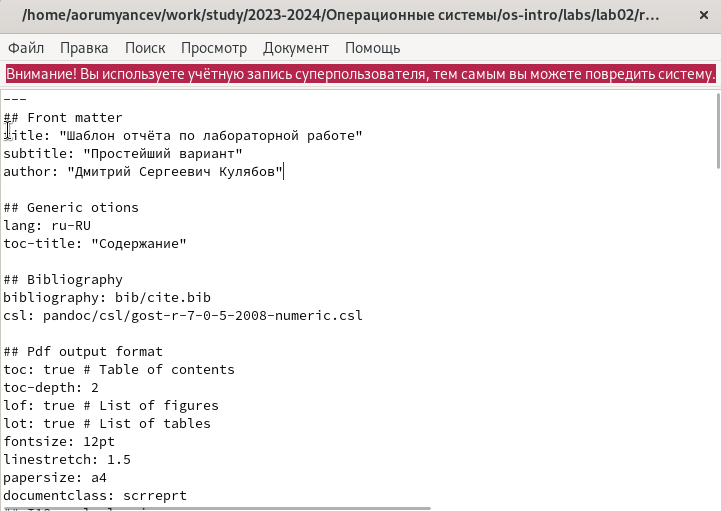

---
## Front matter
title: " Отчёт по лабораторной работе №3"
subtitle: "Операционные системы"
author: "Румянцев Артём Олегович"

## Generic otions
lang: ru-RU
toc-title: "Содержание"

## Bibliography
bibliography: bib/cite.bib
csl: pandoc/csl/gost-r-7-0-5-2008-numeric.csl

## Pdf output format
toc: true # Table of contents
toc-depth: 2
lof: true # List of figures
lot: true # List of tables
fontsize: 12pt
linestretch: 1.5
papersize: a4
documentclass: scrreprt
## I18n polyglossia
polyglossia-lang:
  name: russian
  options:
	- spelling=modern
	- babelshorthands=true
polyglossia-otherlangs:
  name: english
## I18n babel
babel-lang: russian
babel-otherlangs: english
## Fonts
mainfont: PT Serif
romanfont: PT Serif
sansfont: PT Sans
monofont: PT Mono
mainfontoptions: Ligatures=TeX
romanfontoptions: Ligatures=TeX
sansfontoptions: Ligatures=TeX,Scale=MatchLowercase
monofontoptions: Scale=MatchLowercase,Scale=0.9
## Biblatex
biblatex: true
biblio-style: "gost-numeric"
biblatexoptions:
  - parentracker=true
  - backend=biber
  - hyperref=auto
  - language=auto
  - autolang=other*
  - citestyle=gost-numeric
## Pandoc-crossref LaTeX customization
figureTitle: "Рис."
tableTitle: "Таблица"
listingTitle: "Листинг"
lofTitle: "Список иллюстраций"
lotTitle: "Список таблиц"
lolTitle: "Листинги"
## Misc options
indent: true
header-includes:
  - \usepackage{indentfirst}
  - \usepackage{float} # keep figures where there are in the text
  - \floatplacement{figure}{H} # keep figures where there are in the text
---

# Цель работы

Научиться оформлять отчёты с помощью легковесного языка разметки Markdown.

# Задание

1. Сделайте отчёт по предыдущей лабораторной работе в формате markdown.
2. В качестве отчёта предоставляются отчёты в 3 форматах: pdf,docx и md(в архиве,поскольку он должен содержать скриншоты, makefile и тд)

# Теоретическое введение
Markdown — облегчённый язык разметки, созданный с целью обозначения форматирования в простом тексте, с максимальным сохранением его читаемости человеком, и пригодный для машинного преобразования в языки для продвинутых публикаций.

# Выполнение лабораторной работы

Перехожу в каталог,в котором находятся шаблон для отчёта по лабораторной работе, с помопшью утилиты cd(рис. 1).

{#fig:001 width=70%}

Создаю копию шаблона, в которой буду работать с помощью утилиты cp

{#fig:001 width=70%}

Открываю созданный файл с помщью текстового редактора mousepad

{#fig:001 width=70%}

После изменения шаблона в соответствии с языком разметки Markdown, я выполнил его компиляцию из формата md в форматы docx и pdf

{#fig:001 width=70%}

Далее отправил созданные и скомпилированные файлы на глобальный репозиторий

{#fig:001 width=70%}

Последние действие в отправке с помощью команды git push 

{#fig:001 width=70%}

# Выводы

При выполнении данной лабораторной работы я научился оформлять отчёты с помощью языка разметки markdown
