---
## Front matter
title: "Лабораторная работа №6"
subtitle: "Операционные системы"
author: "Румянцев Артём Олегович"

## Generic otions
lang: ru-RU
toc-title: "Содержание"

## Bibliography
bibliography: bib/cite.bib
csl: pandoc/csl/gost-r-7-0-5-2008-numeric.csl

## Pdf output format
toc: true # Table of contents
toc-depth: 2
lof: true # List of figures
lot: true # List of tables
fontsize: 12pt
linestretch: 1.5
papersize: a4
documentclass: scrreprt
## I18n polyglossia
polyglossia-lang:
  name: russian
  options:
	- spelling=modern
	- babelshorthands=true
polyglossia-otherlangs:
  name: english
## I18n babel
babel-lang: russian
babel-otherlangs: english
## Fonts
mainfont: PT Serif
romanfont: PT Serif
sansfont: PT Sans
monofont: PT Mono
mainfontoptions: Ligatures=TeX
romanfontoptions: Ligatures=TeX
sansfontoptions: Ligatures=TeX,Scale=MatchLowercase
monofontoptions: Scale=MatchLowercase,Scale=0.9
## Biblatex
biblatex: true
biblio-style: "gost-numeric"
biblatexoptions:
  - parentracker=true
  - backend=biber
  - hyperref=auto
  - language=auto
  - autolang=other*
  - citestyle=gost-numeric
## Pandoc-crossref LaTeX customization
figureTitle: "Рис."
tableTitle: "Таблица"
listingTitle: "Листинг"
lofTitle: "Список иллюстраций"
lotTitle: "Список таблиц"
lolTitle: "Листинги"
## Misc options
indent: true
header-includes:
  - \PassOptionsToPackage{english,russian}{babel}
  - \usepackage[english,russian]{babel}
  - \usepackage[utf8]{inputenc}
  - \usepackage{indentfirst}
  - \usepackage{float} # keep figures where there are in the text
  - \floatplacement{figure}{H} # keep figures where there are in the text
---

# Цель работы
Приобретение практических навыков взаимодействия пользователя с системой по-
средством командной строки.

# Задание
1. Определите полное имя  домашнего каталога
2. Выполните следующие действия:
2.1. Перейдите в каталог /tmp.
2.2. Вывести на экран содержимое каталога /tmp.
2.3. Определить, есть ли в каталоге /var/spool подкаталог с именем cron.
2.4. Перейти в  домашний каталог и вывести на экран его содержимое. Опре-
делить, кто является владельцем файлов и подкаталогов.

3. Выполнить следующие действия:

    В домашнем каталоге создать новый каталог с именем newdir.
    В каталоге ~/newdir создать новый каталог с именем morefun.
    В домашнем каталоге создать одной командой три новых каталога с именами letters, memos, misk. Затем удалить эти каталоги одной командой.
    Попробовать удалить ранее созданный каталог ~/newdir командой rm. Проверть, был ли каталог удалён.
    Удалить каталог ~/newdir/morefun из домашнего каталога. Проверить, был ли каталог удалён.

4. С помощью команды man определить, какую опцию команды ls нужно использовать для просмотра содержимого не только указанного каталога, но и подкаталогов, входящих в него.
5. С помощью команды man определить набор опций команды ls, позволяющий отсортировать по времени последнего изменения выводимый список содержимого каталога с развёрнутым описанием файлов.
6. Использовать команду man для просмотра описания следующих команд: cd, pwd, mkdir, rmdir, rm. Поясните основные опции этих команд.
7. Используя информацию, полученную при помощи команды history, выполнить модификацию и исполнение нескольких команд из буфера команд.

# Теоретическое введение

В операционной системе типа Linux взаимодействие пользователя с системой обычно осуществляется с помощью командной строки посредством построчного ввода команд. При этом обычно используется командные интерпретаторы языка shell: /bin/sh; /bin/csh; /bin/ksh.

Командой в операционной системе называется записанный по специальным правилам текст (возможно с аргументами), представляющий собой указание на выполнение какой-либо функций (или действий) в операционной системе. Обычно первым словом идёт имя команды, остальной текст — аргументы или опции, конкретизирующие действие.

Общий формат команд можно представить следующим образом: <имя_команды><разделитель><аргументы> Команда man. Команда man используется для просмотра (оперативная помощь) в диалоговом режиме руководства (manual) по основным командам операционной системы типа Linux.

Формат команды: man <команда>

Файловая система ОС типа Linux — иерархическая система каталогов, подкаталогов и файлов, которые обычно организованы и сгруппированы по функциональному признаку. Самый верхний каталог в иерархии называется корневым и обозначается символом /. Корневой каталог содержит системные файлы и другие каталоги.

В работе с командами, в качестве аргументов которых выступает путь к какому-либо каталогу или файлу, можно использовать сокращённую запись пути.

# Выполнение лабораторной работы

Полное имя домашнего каталога можно узнать с помощью утилиты pwd (рис.1]).

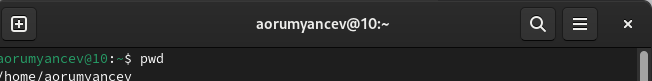{#fig:001 width=70%}

С помощью утилиты cd перехожу в подкаталог tmp корневого каталога (рис. 2)

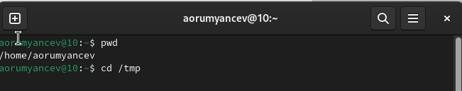{#fig:001 width=70%}

С помощью утилиты ls, пока что без ключей, просматриваю содержимое каталога tmp (рис.3)

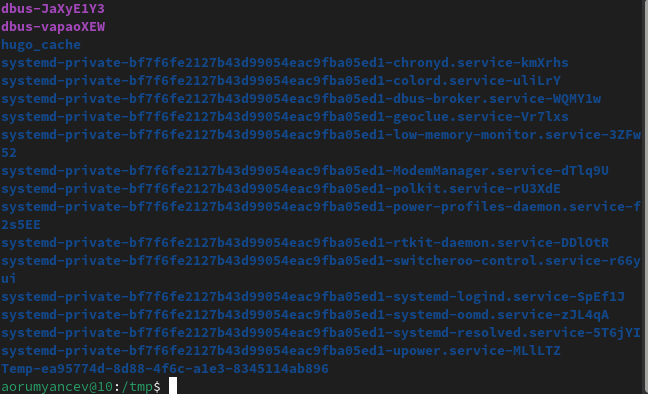{#fig:001 width=70%}

Пробую использовать команду ls с разными опциями. Опция -l позволит увидеть дополнительную информацию о файлах в каталоге: время создания, владельца, права. 
(рис.4)

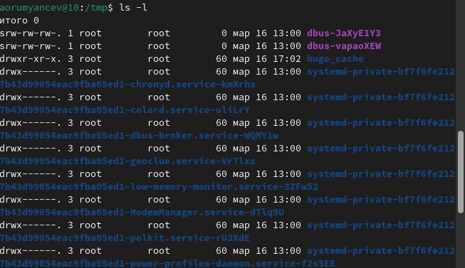{#fig:001 width=70%}

Опция -а покажет скрытые файлы в каталоге(рис.5)

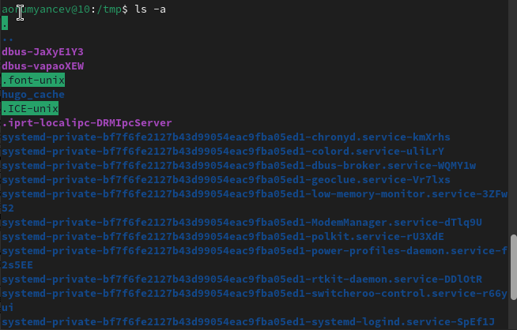{#fig:001 width=70%}

Перехожу в каталог var/spool с помощью cd. Чтобы определить, есть ли в каталоге подкатолог с соответствующем именем, на самом деле, достаточно начать вводить какую-нибудь команду и имя файла и воспользоваться подсказкой tab, многие окружения рабочего стола обозначают файлы и каталоги разными цветами. Но на всякий случай воспользуемся утилитой ls с флагом -F, чтобы проверить, что мы найдем именно каталог.
И да,в директории действительно есть такой каталог (рис.6)

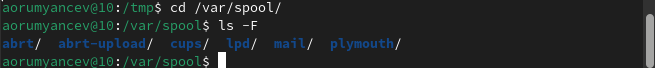{#fig:001 width=70%}

Возвращаюсь в домашний каталог,для этого достаточно ввести команду cd. Затем проверяю содержимое каталога с помощью утилиты ls, опция -l позволяет определить владельцев файлов, опция -а показывает все содержимое каталога,-F поможет определить что из содержимого каталога файл, а что каталог. (рис.7)

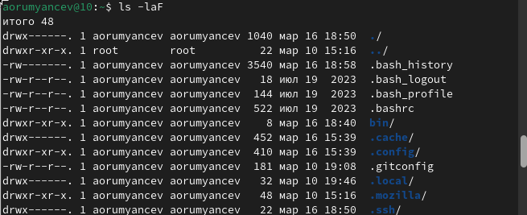{#fig:001 width=70%}

Создаю директорию newdir с помощью утилиты mkdir, затем проверяю,что директория создалась с помощью  ls. (рис.8)

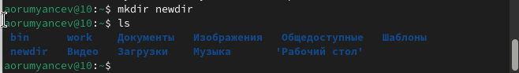{#fig:001 width=70%}

Создаю для каталога newdir подкаталог morefun, проверяю, что каталог собран.(рис.9)

{#fig:001 width=70%}

Чтобы создать несколько директорий одной строчкой нужно перечислить названия директорий через пробел после утилиты mkdir. Проверяю, что все файлы созданы. (рис.10)

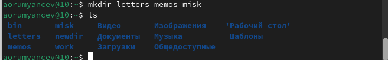{#fig:001 width=70%}

Чтобы удалить несколько пустых директорий одной строчкой нужно перечислить названия директорий через пробел после утилиты  rmdir Проверяю, что все файлы удалены(рис. 11)

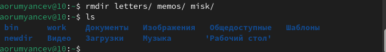{#fig:001 width=70%}

Пытаюсь удалить newdir с помощью rm. Утилиты rm по умолчанию удаляет файлы, чтобы она удалила пустую директорию нужно добавить опцию -d, но newdir не пустая директория, поэтому нужно добавить опцию для рекурсивного удаления -r. Использовалась утилита без опций, поэтому каталог не был удален. (рис.12)

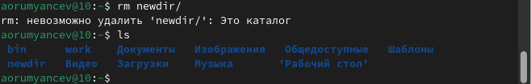{#fig:001 width=70%}

Удаляю директорию newdir с помощью утилиты rmdir, т.к директория не пустая, я добавляю флаг удалить рекурсивно -p, чтобы удалить и все подкаталоги.( рис.13)

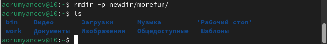{#fig:001 width=70%}

С помощью команды man ls я могу прочесть документацию к команде ls, опция, которая позволит выводить все подкаталоги каталогов предоставлена на скриншоте, это -R. (рис.14)

{#fig:001 width=70%}

Так как мне нужно найти опцию утилиты ls для сортировки,то логично сузить поиск до результатов с таким же вопросом. Выяснила, что для сортировки и вывода информации нужна комбинация опций -it.(рис.15)

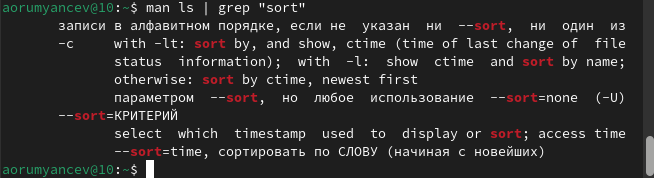{#fig:001 width=70%}

С помощью man cd узнаю описание команды cd и её опции. Основных опций немного.(рис.16)

1.-P - позволяет следовать по символическим ссылкам перед тем, как обработаны все переходы '..'
2.-L - переходит по символическим ссылкам только после того, как обработаны все переходы ".."
3.-e - позволяет выйти с ошибкой, если диреткория, в которую нужно перейти, не найдена.

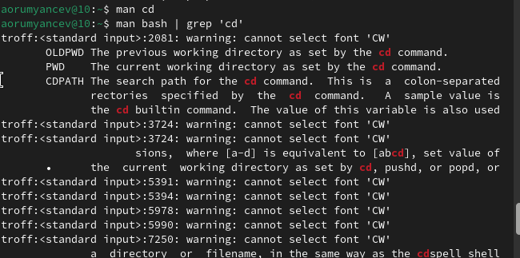{#fig:001 width=70%}

С помощью man pwd узнаю описания команды pwd и её опции(рис.17)

1.-L - брать директорию из переменной окружения, даже если она содержит символические ссылки.
2 -P - отбрасывать все символические ссылки.

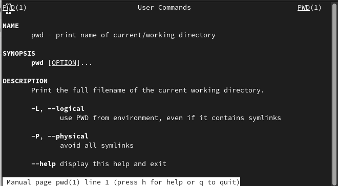{#fig:001 width=70%}

С помощью man mkdir узнаю описание команды mkdir и её опции (рис.18)

1.-m - устанавливает права доступа создаваемой директории как chmod, синтаксис тоже как у chmod.
2.-p - позволяет рекурсивно создавать директории и их подкаталоги
3.-v - выводи сообщение о созданных директориях
4.-z - установить контекст SELinux для создаваемой директории по умолчанию
5.-context - установить контекст SELinux для создаваемой директории в значении CTX

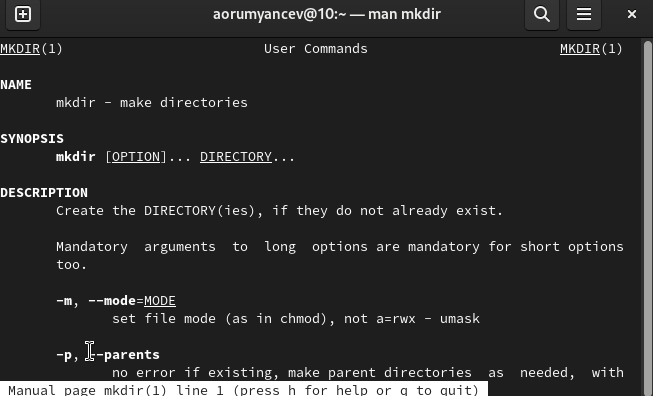{#fig:001 width=70%}

С помощью man rmdir узнаю описание команды rmdir и её опции(рис.19)

1.-ignore-fail-on-non-empty - отменяет вывод ошибки, если каталог не пустой, просто его игнорирует
2.-p - удаляет рекурсивно каталоги, если они все содержат в себе только удаляемый каталог
3.-v - выводит сообщение о каждом удалении директории.

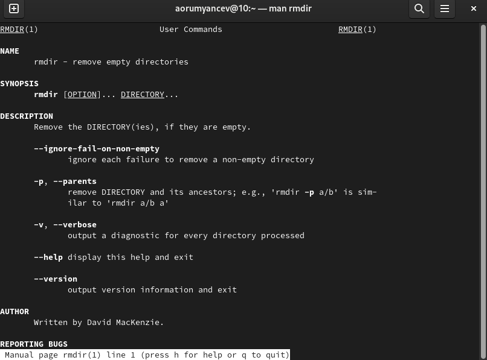{#fig:001 width=70%}

С помощью man rm  узнаю описание команды rm и её опции(рис.20)

1.-f - игнорировать несуществующие файлы или аргументы, никогда не выводить запрос на подтверждение удаления
2.-i - выводить запрос на подтверждение удаления каждого файла
3.-I - вывести запрос на подтверждение удаления один раз, для всех файлов, если удаляется больше 3-х файлов или идет рекурсивное удаление
4.--interactive - заменяет предыдущие три опции, можно выбрать одну из них.
5.--one-file-system - во время рекурсивного удаления пропускать директории из других файловых систем
6.--no-preserve-root если в качестве директории задана корневая, то считать что это обычная директория и начать удаление.
7.-r, -R - удаляет директории их содержимое рекурсивно
8.-d, --dir - удаляет пустые директории
9.-v - прописывает все действия команды

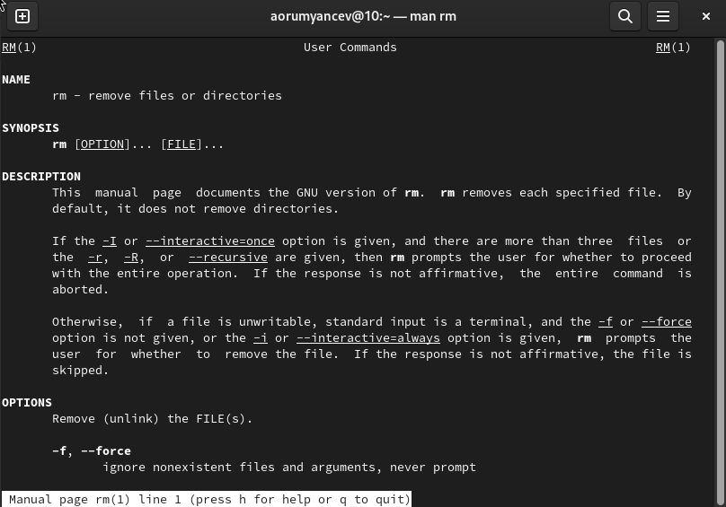{#fig:001 width=70%}

Опции --help --version применимы почти ко всем утилитам, они показывают справку по команде и её версию соответственно.

Вывел историю команд с помощью утилиты history (рис.21)

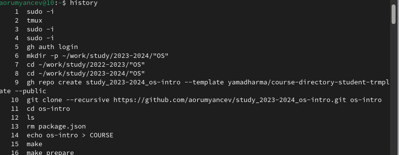{#fig:001 width=70%}

Модифицировал команду (рис.22)

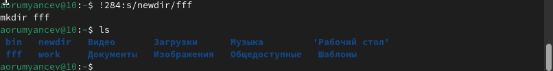{#fig:001 width=70%}

Модифицировал команду (рис.23)

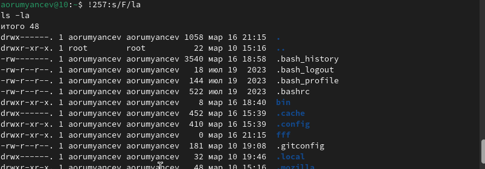{#fig:001 width=70%}

# Выводы

Я приобрел практические навыки взаимодействия пользователя с системой посредством командной строки.

# Ответы на контрольные вопросы

  1. Командная строка - это текстовая система, которая передает команды компьютеру и возвращает результаты пользователю. В операционной системе типа Linux взаимодействие пользователя с системой обычно осуществляется с помощью командной строки посредством построчного ввода команд.
  2. Для определения абсолютного пути к текущему каталогу используется команда pwd. Например: если я введу pwd в своем домашнем каталоге то получу /home/evdvorkina
  3. С помощью команды ls можно определить имена файлов, при помощи опции -F уже мы сможем определить тип файлов, если нам необходимы скрытые файлы, добавим опцию -a. Пример есть в лабораторной работе.
  4. С  помощью команды ls можно определить имена файлов, если нам необходимы скрытые файлы, добавим опцию -a. Пример есть в лабораторной работе.
  5. rmdir по умолчанию удаляет пустые каталоги, не удаляет файлы. rm удаляет файлы, без дополнительных опций (-d, -r) не будет удалять каталоги. Удалить в одной строчке одной командой можно файл и каталог. Если файл находится в каталоге, используем рекурсивное удаление, если файл и каталог не связаны подобным образом, то добавим опцию -d, введя имена через пробел после утилиты.
  6. Вывести информацию о последних выполненных пользователем команд можно с помощью history. Пример приведет в лабораторной работе.
  7. Используем синтаксиси !номеркоманды в выводе history:s/что заменяем/на что заменяем Примеры приведены в лабораторной работе.
  8. Предположим, я нахожусь не в домашнем каталоге. Если я введу "cd ; ls", то окажусь в домашнем каталоге и получу вывод файлов внутри него.
  9. Символ экранирования - (обратный слеш) добавление перед спецсимволом обратный слеш, чтобы использовать специальный символ как обычный. Также позволяет читать системе название директорий с пробелом. Пример: cd work/Операционные\ системы/
  10. Опция -l позволит увидеть дополнительную информацию о файлах в каталоге: время создания, владельца, права доступа
  11. Относительный путь к файлу начинается из той директории, где вы находитесь (она сама не прописывается в пути), он прописывается относительно данной директории. Абсолютный путь начинается с корневого каталога.
  12. Использовать man <имя команды> или <имя команды> --help
  13. Клавиша Tab.

