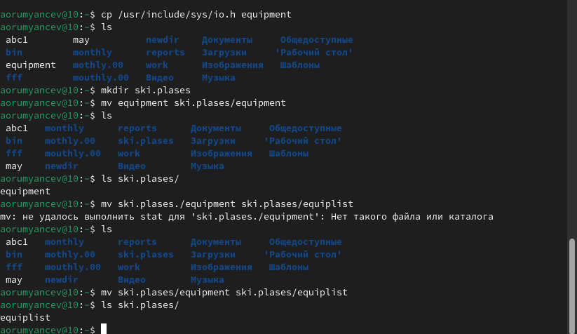
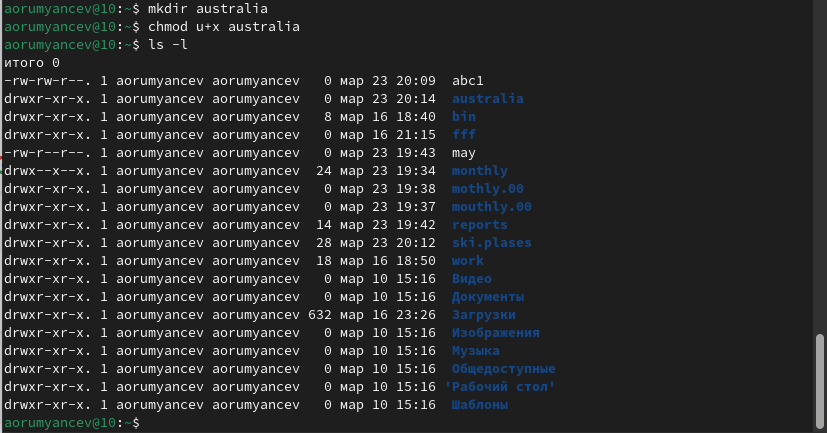
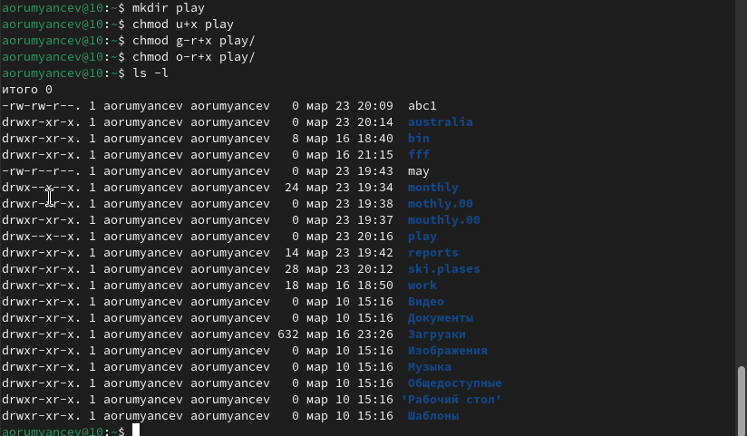

---
## Front matter
title: "Отчёт по лабораторной работе №7"
subtitle: "Операционные системы"
author: "Румянцев Артём Олегович"

## Generic otions
lang: ru-RU
toc-title: "Содержание"

## Bibliography
bibliography: bib/cite.bib
csl: pandoc/csl/gost-r-7-0-5-2008-numeric.csl

## Pdf output format
toc: true # Table of contents
toc-depth: 2
lof: true # List of figures
lot: true # List of tables
fontsize: 12pt
linestretch: 1.5
papersize: a4
documentclass: scrreprt
## I18n polyglossia
polyglossia-lang:
  name: russian
  options:
	- spelling=modern
	- babelshorthands=true
polyglossia-otherlangs:
  name: english
## I18n babel
babel-lang: russian
babel-otherlangs: english
## Fonts
mainfont: PT Serif
romanfont: PT Serif
sansfont: PT Sans
monofont: PT Mono
mainfontoptions: Ligatures=TeX
romanfontoptions: Ligatures=TeX
sansfontoptions: Ligatures=TeX,Scale=MatchLowercase
monofontoptions: Scale=MatchLowercase,Scale=0.9
## Biblatex
biblatex: true
biblio-style: "gost-numeric"
biblatexoptions:
  - parentracker=true
  - backend=biber
  - hyperref=auto
  - language=auto
  - autolang=other*
  - citestyle=gost-numeric
## Pandoc-crossref LaTeX customization
figureTitle: "Рис."
tableTitle: "Таблица"
listingTitle: "Листинг"
lofTitle: "Список иллюстраций"
lotTitle: "Список таблиц"
lolTitle: "Листинги"
## Misc options
indent: true
header-includes:
  - \usepackage{indentfirst}
  - \usepackage{float} # keep figures where there are in the text
  - \floatplacement{figure}{H} # keep figures where there are in the text
---

# Цель работы

Ознакомление с файловой системой Linux, её структурой, именами и содержанием
каталогов. Приобретение практических навыков по применению команд для работы
с файлами и каталогами, по управлению процессами (и работами), по проверке исполь-
зования диска и обслуживанию файловой системы.

# Задание

1. Выполнить все примеры из Лабораторной работы
2. Выполнить команды по копированию, созданию и перемещению файлов и каталогов
3. Определить опции команды chmod 
4. Изменить права доступа к файлам
5. Прочитать документацию о командах mount, fsck, mkfs, kill

# Теоретическое введение

Для создания текстового файла можно использовать команду touch. Для просмотра файлов небольшого размера можно использовать команду cat. Для просмотра файлов постранично удобнее использовать команду less. Команда cp используется для копирования файлов и каталогов. Команды mv и mvdir предназначены для перемещения и переименования файлов и каталогов.

Каждый файл или каталог имеет права доступа. В сведениях о файле или каталоге указываются:

– тип файла (символ (-) обозначает файл, а символ (d) — каталог);

– права для владельца файла (r — разрешено чтение, w — разрешена запись, x — разрешено выполнение, - — право доступа отсутствует);

– права для членов группы (r — разрешено чтение, w — разрешена запись, x — разрешено выполнение, - — право доступа отсутствует);

– права для всех остальных (r — разрешено чтение, w — разрешена запись, x — разрешено выполнение, - — право доступа отсутствует).

Права доступа к файлу или каталогу можно изменить, воспользовавшись командой chmod. Сделать это может владелец файла (или каталога) или пользователь с правами администратора.

Файловая система в Linux состоит из фалов и каталогов. Каждому физическому носителю соответствует своя файловая система. Существует несколько типов файловых систем. Перечислим наиболее часто встречающиеся типы:

– ext2fs (second extended filesystem);

– ext2fs (third extended file system);

– ext4 (fourth extended file system);

– ReiserFS;

– xfs;

– fat (file allocation table);

– ntfs (new technology file system).

Для просмотра используемых в операционной системе файловых систем можно вос- пользоваться командой mount без параметров.

# Выполнение лабораторной работы

Создаю файл, дважды копирую его с новыми именами и проверяю, что все команды были выполнены корректно.

Создаю директорию, копирую в нее два файла, созданных на прошлом этапе, проверяю, что все скопировалось.

Копирую файл, находящийся не в текущей директории в файл с новым именем тоже не текущей директории

Создаю новую директорию. Копирую предыдущую созданную директорию вместе со всем содержимым в каталог /tmp. Затем копирую предыдущую созданную директорию в новую созданную.

Переименовываю файл, затем перемещаю его в каталог

Создаю новую директорию, переименовываю monthly.00 в monthly.01, перемещаю директорию в директорию  reports, переименовываю эту директорию, убираю из названия 01

Создаю пустой файл, проверяю права доступа у него, изменяю права доступа, добавляя пользователю(создателю) можно выполнять файл

Меняю права доступа у директории: группы и остальные пользователи не смогут её прочесть 

Изменяю права доступа у директории, запрещаю группам и остальным пользователям читать. Создаю новый пустой файл, даю ему права доступа: группы могут в этом читать, писать содержимое.

Проверяю файловую систему

Копирую файл в домашний каталог с новым именем, создаю новую пустую директорию, перемещаю файл в эту директорию, переименовываю файл.

Создаю новый файл, копирую его в новую директорию, но уже сразу с новым именем. Создаю внутри этого каталога подкаталог, перемещаю файлы в подкаталог.

Создаю новую директорию, в этой же строчке перемещаю её с новым именем в директорию, созданную в прошлый раз.

Проверяю, какие права нужно поменять и как, чтобы у новой директории были нужные по заданию права

Проверяю, какие права нужно поменять и как,чтобы у новых файлов были нужные по заданию права.

Создаю файл, добавляю в правах доступа право, но исполнение и убираю право на запись для владельца, затем создаю следующий файл, ему в правах доступа добавляю право на запись для группы.

Читаю содержимое файл

Копирую файл с новым именем, перемещаю его в ранее созданную директорию, рекурсивно её копирую с новым именем, рекурсивно копирую в неё скопированную до этого папку 

Убираю право на чтение у файла для создателя, поэтому не могу его прочесть, также не могу его скопировать, потому что отказано в доступе на чтение, возвращаю все права.

Убираю у директории право на исполнение для пользователя, пытаюсь в неё войти - отказано в доступе, возвращаю все права.

Я прочитал описание каждой из четырех команд с помощью man.

- mount — утилита командной строки в UNIX-подобных операционных системах. Применяется для монтирования файловых систем.
- fsck (проверка файловой системы) - это утилита командной строки, которая позволяет выполнять проверки согласованности и интерактивное исправление в одной или нескольких файловых системах Linux. Он использует программы, специфичные для типа файловой системы, которую он проверяет.
- mkfs используется для создания файловой системы Linux на некотором устройстве, обычно в разделе жёсткого диска. В качестве аргумента filesys для файловой системы может выступать или название устройства
- Команда Kill посылает указанный сигнал указанному процессу. Если не указано ни одного сигнала, посылается сигнал SIGTERM. Сигнал SIGTERM завершает лишь те процессы, которые не обрабатывают его приход. Для других процессов может быть необходимым послать сигнал SIGKILL, поскольку этот сигнал перехватить невозможно.

# Выводы

При выполнении данной лабораторной работы я ознакомился с файловой системой Linux, её структурой, именами и содержанием каталогов. Приобрел практические навыки по применению команд для работы с файлами и каталогами, по управлению процессами( и работами), по проверке использования диска и обслуживания файловой системы.

# Ответы на контрольные вопросы

1. Дайте характеристику каждой файловой системе, существующей на жёстком диске компьютера, на котором вы выполняли лабораторную работу.
Ext2, Ext3, Ext4 или Extended Filesystem - это стандартная файловая система для Linux. Она была разработана еще для Minix. Она самая стабильная из всех существующих, кодовая база изменяется очень редко и эта файловая система содержит больше всего функций. Версия ext2 была разработана уже именно для Linux и получила много улучшений. В 2001 году вышла ext3, которая добавила еще больше стабильности благодаря использованию журналирования. В 2006 была выпущена версия ext4, которая используется во всех дистрибутивах Linux до сегодняшнего дня. В ней было внесено много улучшений, в том числе увеличен максимальный размер раздела до одного экзабайта.

Btrfs или B-Tree File System - это совершенно новая файловая система, которая сосредоточена на отказоустойчивости, легкости администрирования и восстановления данных. Файловая система объединяет в себе очень много новых интересных возможностей, таких как размещение на нескольких разделах, поддержка подтомов, изменение размера не лету, создание мгновенных снимков, а также высокая производительность. Но многими пользователями файловая система Btrfs считается нестабильной. Тем не менее, она уже используется как файловая система по умолчанию в OpenSUSE и SUSE Linux.

2. Приведите общую структуру файловой системы и дайте характеристику каждой директории первого уровня этой структуры.

/ — root каталог. Содержит в себе всю иерархию системы;

/bin — здесь находятся двоичные исполняемые файлы. Основные общие команды, хранящиеся отдельно от других программ в системе (прим.: pwd, ls, cat, ps);

/boot — тут расположены файлы, используемые для загрузки системы (образ initrd, ядро vmlinuz);

/dev — в данной директории располагаются файлы устройств (драйверов). С помощью этих файлов можно взаимодействовать с устройствами. К примеру, если это жесткий диск, можно подключить его к файловой системе. В файл принтера же можно написать напрямую и отправить задание на печать;

/etc — в этой директории находятся файлы конфигураций программ. Эти файлы позволяют настраивать системы, сервисы, скрипты системных демонов;

/home — каталог, аналогичный каталогу Users в Windows. Содержит домашние каталоги учетных записей пользователей (кроме root). При создании нового пользователя здесь создается одноименный каталог с аналогичным именем и хранит личные файлы этого пользователя;

/lib — содержит системные библиотеки, с которыми работают программы и модули ядра;

/lost+found — содержит файлы, восстановленные после сбоя работы системы. Система проведет проверку после сбоя и найденные файлы можно будет посмотреть в данном каталоге;

/media — точка монтирования внешних носителей. Например, когда вы вставляете диск в дисковод, он будет автоматически смонтирован в директорию /media/cdrom;

/mnt — точка временного монтирования. Файловые системы подключаемых устройств обычно монтируются в этот каталог для временного использования;

/opt — тут расположены дополнительные (необязательные) приложения. Такие программы обычно не подчиняются принятой иерархии и хранят свои файлы в одном подкаталоге (бинарные, библиотеки, конфигурации);

/proc — содержит файлы, хранящие информацию о запущенных процессах и о состоянии ядра ОС;

/root — директория, которая содержит файлы и личные настройки суперпользователя;

/run — содержит файлы состояния приложений. Например, PID-файлы или UNIX-сокеты;

/sbin — аналогично /bin содержит бинарные файлы. Утилиты нужны для настройки и администрирования системы суперпользователем;

/srv — содержит файлы сервисов, предоставляемых сервером (прим. FTP или Apache HTTP);

/sys — содержит данные непосредственно о системе. Тут можно узнать информацию о ядре, драйверах и устройствах;

/tmp — содержит временные файлы. Данные файлы доступны всем пользователям на чтение и запись. Стоит отметить, что данный каталог очищается при перезагрузке;

/usr — содержит пользовательские приложения и утилиты второго уровня, используемые пользователями, а

не системой. Содержимое доступно только для чтения (кроме root). Каталог имеет вторичную иерархию и похож на корневой;

/var — содержит переменные файлы. Имеет подкаталоги, отвечающие за отдельные переменные. Например, логи будут храниться в /var/log, кэш в /var/cache, очереди заданий в /var/spool/ и так далее.

3. Какая операция должна быть выполнена, чтобы содержимое некоторой файловой системы было доступно операционной системе? Монтирование тома.

4. Назовите основные причины нарушения целостности файловой системы. Как устранить повреждения файловой системы?
Отсутствие синхронизации между образом файловой системы в памяти и ее данными на диске в случае аварийного останова может привести к появлению следующих ошибок:

Один блок адресуется несколькими mode (принадлежит нескольким файлам).
Блок помечен как свободный, но в то же время занят (на него ссылается onode).
Блок помечен как занятый, но в то же время свободен (ни один inode на него не ссылается).
Неправильное число ссылок в inode (недостаток или избыток ссылающихся записей в каталогах).
Несовпадение между размером файла и суммарным размером адресуемых inode блоков.
Недопустимые адресуемые блоки (например, расположенные за пределами файловой системы).
"Потерянные" файлы (правильные inode, на которые не ссылаются записи каталогов).
Недопустимые или неразмещенные номера inode в записях каталогов.

5. Как создаётся файловая система? mkfs - позволяет создать файловую систему Linux.

6. Дайте характеристику командам для просмотра текстовых файлов.
Cat - выводит содержимое файла на стандартное устройство вывода. Выполнение команды head выведет первые 10 строк текстового файла. Выполнение команды tail выведет последние 10 строк текстового файла. Команда tac - это тоже самое, что и cat, только отображает строки в обратном порядке. Для того, чтобы просмотреть огромный текстовый файл применяются команды для постраничного просмотра. Такие как more и less.

7. Приведите основные возможности команды cp в Linux.
    Cp – копирует или перемещает директорию, файлы.

8. Приведите основные возможности команды mv в Linux.
    Mv - переименовать или переместить файл или директорию

9. Что такое права доступа? Как они могут быть изменены?
    Права доступа к файлу или каталогу можно изменить, воспользовавшись командой chmod. Сделать это может владелец файла (или каталога) или пользователь с правами администратора.

