---
## Front matter
title: "Отчёт по лабораторной работе № 8"
subtitle: "Операционные системы"
author: "Румянцев Артём Олегович"

## Generic otions
lang: ru-RU
toc-title: "Содержание"

## Bibliography
bibliography: bib/cite.bib
csl: pandoc/csl/gost-r-7-0-5-2008-numeric.csl

## Pdf output format
toc: true # Table of contents
toc-depth: 2
lof: true # List of figures
lot: true # List of tables
fontsize: 12pt
linestretch: 1.5
papersize: a4
documentclass: scrreprt
## I18n polyglossia
polyglossia-lang:
  name: russian
  options:
	- spelling=modern
	- babelshorthands=true
polyglossia-otherlangs:
  name: english
## I18n babel
babel-lang: russian
babel-otherlangs: english
## Fonts
mainfont: PT Serif
romanfont: PT Serif
sansfont: PT Sans
monofont: PT Mono
mainfontoptions: Ligatures=TeX
romanfontoptions: Ligatures=TeX
sansfontoptions: Ligatures=TeX,Scale=MatchLowercase
monofontoptions: Scale=MatchLowercase,Scale=0.9
## Biblatex
biblatex: true
biblio-style: "gost-numeric"
biblatexoptions:
  - parentracker=true
  - backend=biber
  - hyperref=auto
  - language=auto
  - autolang=other*
  - citestyle=gost-numeric
## Pandoc-crossref LaTeX customization
figureTitle: "Рис."
tableTitle: "Таблица"
listingTitle: "Листинг"
lofTitle: "Список иллюстраций"
lotTitle: "Список таблиц"
lolTitle: "Листинги"
## Misc options
indent: true
header-includes:
  - \usepackage{indentfirst}
  - \usepackage{float} # keep figures where there are in the text
  - \floatplacement{figure}{H} # keep figures where there are in the text
---

# Цель работы

Ознакомление с инструментами поиска файлов и фильтрации текстовых данных.
Приобретение практических навыков: по управлению процессами (и заданиями), по
проверке использования диска и обслуживанию файловых систем

# Задание

1. Осуществить входв систему, используя соответствующее имя пользователя.
2. Записать в файл file.txt названия файлов, содержащихся в каталоге /etc. Допи-
сать в этот же файл названия файлов, содержащихся в вашем домашнем каталоге.
3. Вывести имена всех файлов из file.txt, имеющих расширение .conf, после чего
записать их в новый текстовой файл conf.txt.
4. Определить, какие файлы в вашем домашнем каталоге имеют имена, начинавшиеся
с символа c? Предложите несколько вариантов, как это сделать.
5. Вывести  на экран (по странично) имена файлов из каталога /etc, начинающиеся
с символа h.
6. Запустить в фоновом режиме процесс, который будет записывать в файл ~/logfile
файлы, имена которых начинаются с log.
7. Удалить файл ~/logfile.
8. Запустить из консоли в фоновом режиме редактор gedit.
9. Определить идентификатор процесса gedit, используя команду ps, конвейер и фильтр
grep. Как ещё можно определить идентификатор процесса?
10. Прочтитать справку (man) команды kill, после чего используйте её для завершения
процесса gedit.
11. Выполнить команды df и du, предварительно получив более подробную информацию
об этих командах, с помощью команды man.
12. Воспользовавшись справкой команды find, вывести имена всех директорий, имею-
щихся в вашем домашнем каталоге.
# Теоретическое введение
В интерфейсе командной строки есть очень полезная возможность перенаправления (переадресации) ввода и вывода (англ. термин I/O Redirection). Как мы уже заметили, многие программы выводят данные на экран. А ввод данных в терминале осуществляется с клавиатуры. С помощью специальных обозначений можно перенаправить вывод многих команд в файлы или иные устройства вывода (например, распечатать на принтере). Тоже самое и со вводом информации, вместо ввода данных с клавиатуры, для многих программ можно задать считывание символов их файла. Кроме того, можно даже вывод одной программы передать на ввод другой программе.

К каждой программе, запускаемой в командной строке, по умолчанию подключено три потока данных:

STDIN (0) — стандартный поток ввода (данные, загружаемые в программу). STDOUT (1) — стандартный поток вывода (данные, которые выводит программа). По умолчанию — терминал. STDERR (2) — стандартный поток вывода диагностических и отладочных сообщений (например, сообщениях об ошибках). По умолчанию — терминал.

Pipe (конвеер) – это однонаправленный канал межпроцессного взаимодействия. Термин был придуман Дугласом Макилроем для командной оболочки Unix и назван по аналогии с трубопроводом. Конвейеры чаще всего используются в shell-скриптах для связи нескольких команд путем перенаправления вывода одной команды (stdout) на вход (stdin) последующей, используя символ конвеера ‘|’.

# Выполнение лабораторной работы

Я вошел в систему под соответствующим именем пользователя, открыл терминал, записал в файл file.txt названия файлов из каталога /etc с помощью перенаправления ">" (и файл создал, и записал в него то, что могло быть выведено ls -lR /etc). В файл я добавил  также все файлы из подкаталога.

Проверил, что в файл записались нужные значения с помощью утилиты head, она выводит первые 10 строк файла на экран.

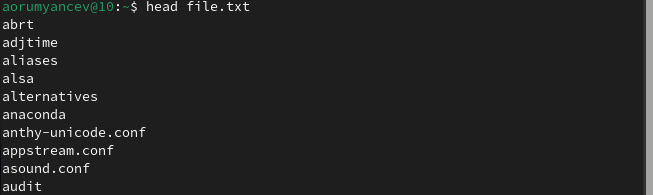

Добавил в созданный файл имена файлов из домашнего каталога, используя перенаправление ">>" в режиме добавления.

Вывел на экран имена всех файлов,  имеющих расширение ".conf" с помощью утилиты grep

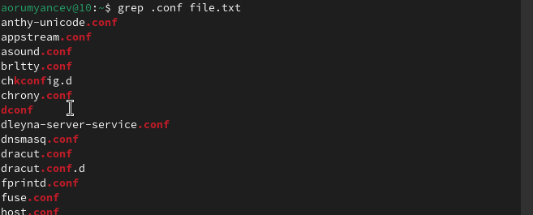

Добавил вывод прошлой команды в новый файл conf.txt с помощью перенаправления ">" (файл создается при выполнении этой команды)

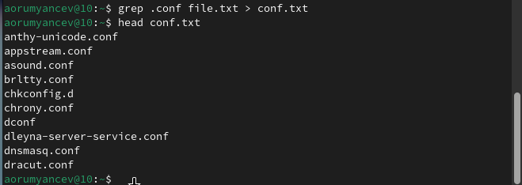

Определяю,какие файлы в домашнем каталоге начинаютя с символа "c" с помощью утилиты find, прописываю ей в аргументах домашнюю директорию (тогда вывод относительно корневого каталога, а не домашнего будет), выбираю опцию -name (ищем по имени), и пишу маску, по которой будем искать имя, где * - любое кол-во любых символов, добавляю опцию -print, чтобы мне вывелся результат. Но таким образом я получаю информацию даже о файлах из подкаталогов домашнего каталога.

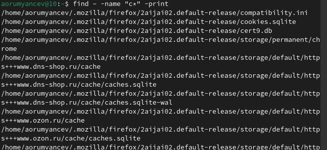

Второй способ использовать утилиту ls lR и использовать grep, чтобы найти элементы с первым символом с. Однако этот способ не работает для поиска файлов из подкаталогов каталога 

С помощью метода find, чьи опции я расписала ранее, ищу все файлы, начинающиеся с буквы "h"

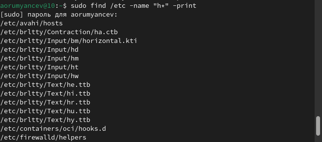

Запускаю в фоновом режиме ( на это указывает символ &) процесс, который будет записывать в файл logfile( с помощью перенаправления >) файлы, имена которых начинаются с log.

Проверяю, что файл создан, удаляю его, проверяю, что файл удален

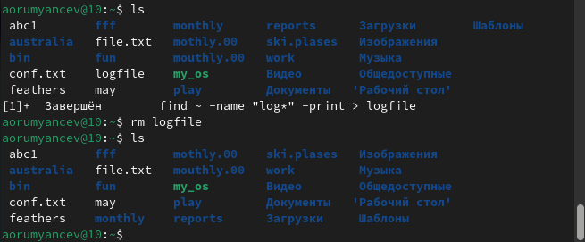

Запускаю в консоли в фоновом режиме( с помощью символа &) редактор mousepad, потому что редактора gedit у меня, к сожалению, но работают они идентично.

С помощью утилиты ps определяю идентификатор процесса mousepad, его значение 3025. Также мы можем определить идентификатор с помощью pgrep.

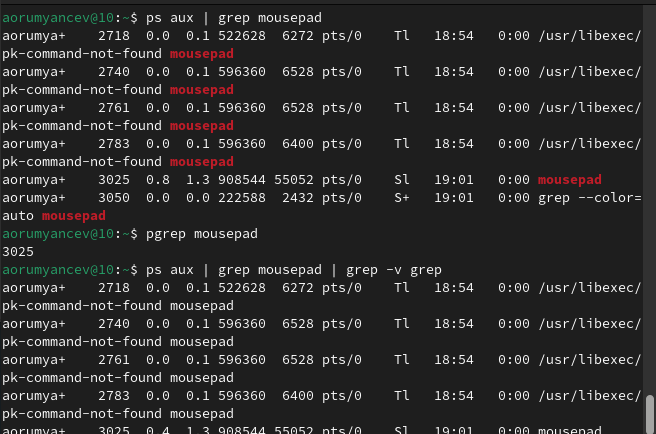

Прочитал справку команды kil

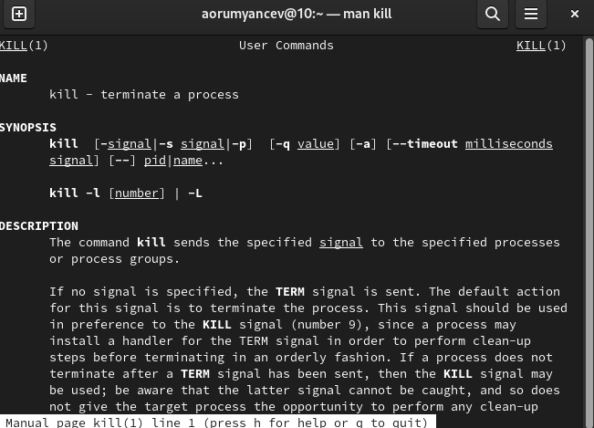
Использую команду kill и идентификатор процесса, чтобы его удалить.

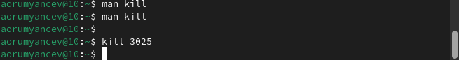

Прочитал документацию про функции df и du.

Использую утилиту df опции -iv позволяет увидеть информацию об инодах и сделать вывод читаемым, игнорируя сообщения системы о нем. Эта утилиты нам нужна, чтобы выяснить, сколько свободного места есть у нашей системы.

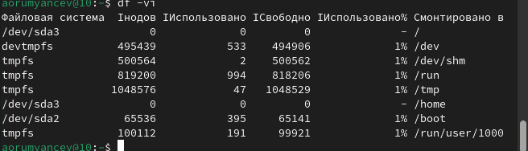

Использую утилиту du. Она нужна чтобы посмотреть, сколько места занимают файлы в определенной директории и найти самые большие из них.

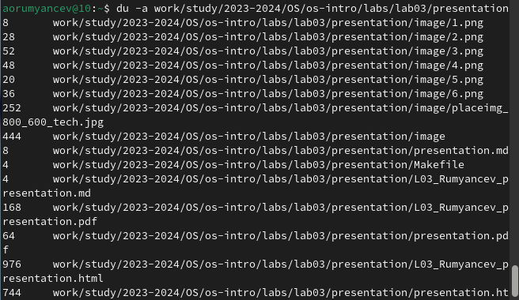

Прочитал документацию о команде find.

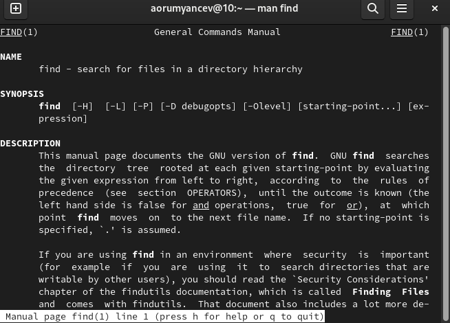

Вывел имена всех директорий, имеющихся в моем домашнем каталоге, используя аргументы d у утилиты find опции -type, то есть указываю тип файлов, который мне нужен и этот тип Директория. Утилита -а позволит увидеть размер всех файлов, а не только директорий.

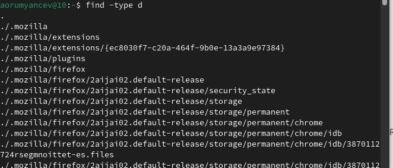

# Выводы

В результате данной лабораторной работы я ознакомился с инструментами поиска файлов и фильтрации текстовых данных, а также приобрел практические навыки по управлению процессами (и заданиями), по проверке использования диска и по обслуживанию файловых систем. 

