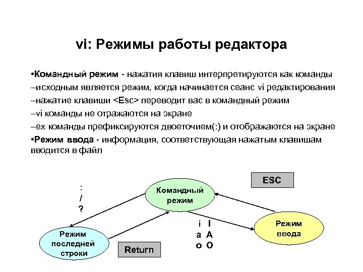

---
## Front matter
lang: ru-RU
title: Отчёт по лабораторной работе №10
subtitle: Операционные системы
author:
  - Румянцев А. О.
institute:
  - Российский университет дружбы народов, Москва, Россия
date: 13 апрель 2024

## i18n babel
babel-lang: russian
babel-otherlangs: english

## Formatting pdf
toc: false
toc-title: Содержание
slide_level: 2
aspectratio: 169
section-titles: true
theme: metropolis
header-includes:
 - \metroset{progressbar=frametitle,sectionpage=progressbar,numbering=fraction}
 - '\makeatletter'
 - '\beamer@ignorenonframefalse'
 - '\makeatother'
---

# Цель работы

Познакомиться с операционной системой Linux. Получить практические навыки рабо-
ты с редактором vi, установленным по умолчанию практически во всех дистрибутивах.

# Задание

1. Ознакомиться с теоретическим материалом
2. Ознакомиться с редактором vi.
3. Выполнить упражнения, используя vi

# Теоретическое введение

В большинстве дистрибутивов Linux в качестве текстового редактора по умолчанию устанавливается интерактивный экранный редактор vi (Visual display editor). Редактор vi имеет три режима работы:

Командный режим — предназначен для ввода команд редактирования и навигации по редактируемому файлу;
режим вставки — предназначен для ввода содержания редактируемого файла;
режим последней (или командной) строки — используется для записи изменений в файл и выхода из редактора.
Для вызова редактора vi необходимо указать команду vi и имя редактируемого файла: vi <имя_файла> При этом в случае отсутствия файла с указанным именем будет создан такой файл.
Переход в командный режим осуществляется нажатием клавиши Esc.
Для выхода из редактора vi необходимо перейти в -режим последней строки: находясь в командном режиме, нажать Shift-; (по сути символ : — двоеточие), затем:
набрать символы wq, если перед выходом из редактора требуется записать изменения в файл;
набрать символ q (или q!), если требуется выйти из редактора без сохранения.

# Выполнение лабораторной работы

## Создаю директорию, в которой буду работать, с помощью команды mkdir, перехожу в нее с помощью команды cd, создаю и открываю для редактирования файл с помощью встроенного текстового редактора vi

## Нажимаю i, чтобы начать редактирование и добавлять текст(режим добавления), далее добавляю текст.

## Нажимаю esc, чтобы выйти из режима добавления и перейти в командный режим. Перехожу в режим последней строки (клавиша :).

## Ввожу w для сохранения и q для выхода и нажимаю enter, после чего файл сохраняется с изменениями и я возвращаюсь в терминал

## С помощью chmod добавляю права на исполнение файла, делая его исполняемым.

## Снова открываю этот файл с помощью текстового редактора vi. Изменяю местоположение курсора

## В режиме добавления(клавиша i) удаляю слово LOCAL, снова перехожу в командный режим с помощью esc.

{#fig:001 width=70%}

## В режиме добавления добавляю слово local, снова перехожу в командный режим с помощью esc.

{#fig:001 width=70%}

## В режиме добавления перехожу в конец последней строки и добавляю новую строку, снова перехожу в командный режим с помощью esc. После этого я вернулся в режим добавления, удалил строку и вернулся в командный режим.

{#fig:001 width=70%}

## В командном режиме я нажал "u" и отменил последнее действие, удаление строки. После перешёл в режим последней строки и ввел w для сохранения файла и q для выхода, нажал enter и файл закрылся

{#fig:001 width=70%}

# Выводы

При выполнении данной лабораторной работы я познакомился с операционной системой Linux, получил практические навыки работы с редактором vi, установленный по умолчанию во всех дистрибутивах.

# Ответы на контрольные вопросы
## 1. Дайте краткую характеристику режимам работы редактора vi.

- командный режим — предназначен для ввода команд редактирования и навигации по редактируемому файлу;
- режим вставки — предназначен для ввода содержания редактируемого файла;
- режим последней (или командной) строки — используется для записи изменений в файл и выхода из редактора.

## 2. Как выйти из редактора, не сохраняя произведённые изменения?

Можно нажимать символ q (или q!), если требуется выйти из редактора без сохранения.

## 3. Назовите и дайте краткую характеристику командам позиционирования.
- 0 (ноль) — переход в начало строки;
- $ — переход в конец строки;
- G — переход в конец файла;
- n G — переход на строку с номером n.

## 4. Что для редактора vi является словом?

Редактор vi предполагает, что слово - это строка символов, которая может включать в себя буквы, цифры и символы подчеркивания.

## 5. Каким образом из любого места редактируемого файла перейти в начало (конец) файла?

С помощью G — переход в конец файла

## 6. Назовите и дайте краткую характеристику основным группам команд редактирования.

- Вставка текста – а — вставить текст после курсора; – А — вставить текст в конец строки; – i — вставить текст перед курсором; – n i — вставить текст n раз; – I — вставить текст в начало строки.
- Вставка строки – о — вставить строку под курсором; – О — вставить строку над курсором.
- Удаление текста – x — удалить один символ в буфер; – d w — удалить одно слово в буфер; – d $ — удалить в буфер текст от курсора до конца строки; – d 0 — удалить в буфер текст от начала строки до позиции курсора; – d d — удалить в буфер одну строку; – n d d — удалить в буфер n строк.
- Отмена и повтор произведённых изменений – u — отменить последнее изменение; – . — повторить последнее изменение.
- Копирование текста в буфер – Y — скопировать строку в буфер; – n Y — скопировать n строк в буфер; – y w — скопировать слово в буфер.
- Вставка текста из буфера – p — вставить текст из буфера после курсора; – P — вставить текст из буфера перед курсором.
- Замена текста – c w — заменить слово; – n c w — заменить n слов; – c $ — заменить текст от курсора до конца строки; – r — заменить слово; – R — заменить текст.
- Поиск текста – / текст — произвести поиск вперёд по тексту указанной строки символов текст; – ? текст — произвести поиск назад по тексту указанной строки символов текст.

## 7. Необходимо заполнить строку символами $. Каковы ваши действия?

Перейти в режим вставки.

## 8. Как отменить некорректное действие, связанное с процессом редактирования?

С помощью u — отменить последнее изменение

## 9. Назовите и дайте характеристику основным группам команд режима последней строки.

Режим последней строки — используется для записи изменений в файл и выхода из редактора.

## 10. Как определить, не перемещая курсора, позицию, в которой заканчивается строка?

$ — переход в конец строки

## 11. Выполните анализ опций редактора vi (сколько их, как узнать их назначение и т.д.).

Опции редактора vi позволяют настроить рабочую среду. Для задания опций используется команда set (в режиме последней строки): – : set all — вывести полный список опций; – : set nu — вывести номера строк; – : set list — вывести невидимые символы; – : set ic — не учитывать при поиске, является ли символ прописным или строчным.

## 12. Как определить режим работы редактора vi?

В редакторе vi есть два основных режима: командный режим и режим вставки. По умолчанию работа начинается в командном режиме. В режиме вставки клавиатура используется для набора текста. Для выхода в командный режим используется клавиша Esc или комбинация Ctrl + c.

## 13. Постройте граф взаимосвязи режимов работы редактора vi.(рис. @fig:013).

{#fig:013 width=70%}

