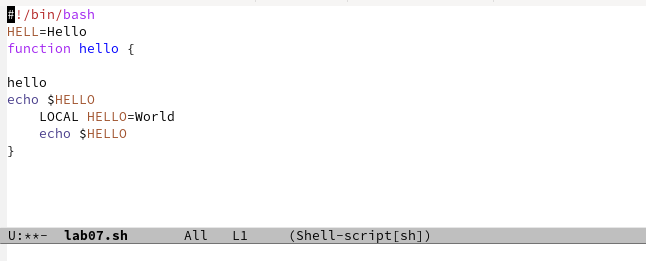

---
## Front matter
title: "Отчёт по лабораторной работе №11"
subtitle: "Операционные системы"
author: "Румянцев Артём Олегович"

## Generic otions
lang: ru-RU
toc-title: "Содержание"

## Bibliography
bibliography: bib/cite.bib
csl: pandoc/csl/gost-r-7-0-5-2008-numeric.csl

## Pdf output format
toc: true # Table of contents
toc-depth: 2
lof: true # List of figures
lot: true # List of tables
fontsize: 12pt
linestretch: 1.5
papersize: a4
documentclass: scrreprt
## I18n polyglossia
polyglossia-lang:
  name: russian
  options:
	- spelling=modern
	- babelshorthands=true
polyglossia-otherlangs:
  name: english
## I18n babel
babel-lang: russian
babel-otherlangs: english
## Fonts
mainfont: PT Serif
romanfont: PT Serif
sansfont: PT Sans
monofont: PT Mono
mainfontoptions: Ligatures=TeX
romanfontoptions: Ligatures=TeX
sansfontoptions: Ligatures=TeX,Scale=MatchLowercase
monofontoptions: Scale=MatchLowercase,Scale=0.9
## Biblatex
biblatex: true
biblio-style: "gost-numeric"
biblatexoptions:
  - parentracker=true
  - backend=biber
  - hyperref=auto
  - language=auto
  - autolang=other*
  - citestyle=gost-numeric
## Pandoc-crossref LaTeX customization
figureTitle: "Рис."
tableTitle: "Таблица"
listingTitle: "Листинг"
lofTitle: "Список иллюстраций"
lotTitle: "Список таблиц"
lolTitle: "Листинги"
## Misc options
indent: true
header-includes:
  - \usepackage{indentfirst}
  - \usepackage{float} # keep figures where there are in the text
  - \floatplacement{figure}{H} # keep figures where there are in the text
---

# Цель работы

Познакомиться с операционной системой Linux. Получить практические навыки рабо-
ты с редактором Emacs.

# Задание

1. Ознакомиться с теоретическим материалом
2. Ознакомиться с редактором emacs.
3. Выполнить упражнения. 
4. Ответить на контрольные вопросы. 

# Теоретическое введение

Emacs — один из наиболее мощных и широко распространённых редакторов, используемых в мире UNIX. По популярности он соперничает с редактором vi и его клонами. В зависимости от ситуации, Emacs может быть:

- текстовым редактором;
- программой для чтения почты и новостей Usenet;
- интегрированной средой разработки (IDE);
- операционной системой;

Всё это разнообразие достигается благодаря архитектуре Emacs, которая позволяет расширять возможности редактора при помощи языка Emacs Lisp. На языке C написаны лишь самые базовые и низкоуровневые части Emacs, включая полнофункциональный интерпретатор языка Lisp. Таким образом, Emacs имеет встроенный язык программирования, который может использоваться для настройки, расширения и изменения поведения редактора. В действительности, большая часть того редактора, с которым пользователи Emacs работают в наши дни, написана на языке Lisp.

Первая версия редактора Emacs была написана в 70-х годах 20-го столетия Richard Stallman (Ричардом Столманом) как набор макросов для редактора TECO . В дальнейшем, уже будучи основателем Фонда Свободного программного обеспечения Free Software Foundation и проекта GNU, Stallman разработал GNU Emacs в развитие оригинального Emacs и до сих пор сопровождает эту программу. Emacs является одним из старейших редакторов. Он использовался тысячами программистов на протяжении последних 20 с лишним лет, для него создано много дополнительных пакетов расширений. Эти дополнения позволяют делать с помощью Emacs такие вещи, которые Stallman , вероятно, даже не считал возможными в начале своей работы над редактором.

# Выполнение лабораторной работы

Открываю Emacs через терминал.

Создаю файл lab07.sh

Прописываю в файле текст программы.

Сохраняю файл с помощью комбинации С-x С-s.

Вырезаю одной командой целую строку (С-к)

Вставляю эту строку в конец файла (С-у).

Выделяю область текста(С-space), копирую область в буфер обмена (М-w), вырезаю эту область с помощью С-w.

Вставляю область в конец файла (С-у).

Отменяю последнее действие С-/

Перевожу курсор в начало строки С-а

Перемещаю курсор в конец строки С-е

Перемещаю курсор в начало файла М-<

Перемещаю курсор в конец файла М->

Открываю список активных буферов в другой окне С-х С-b

Переключаюсь на другой буфер С-х о

Закрываю окно другого буфера С-х 0

Открываю другой буфер без вывода их списка на экран с помощью С-х b

Делю фрейм на 4 части: сначала на два окна по вертикали(С-х 3), а затем каждое из этих окон на две части по горизонтали(С-х 2).

В каждой из четырех созданных окон с помощью С-х b открыл разные буферы.

Перехожу в режим поиска с помощью С-s, ищу слова в тексте, они подсвечиваются.

С помощью той же комбинации С-s я могу перемещаться по результатам поиска.

С помощью С-g выхожу из режима поиска, снимается выделение.

Перехожу в режим поиска и замены с помощью М-%,ввожу какое слов хочу заменить,затем ввожу на какое хочу заменить 

Видим, что слова были заменены успешно

С помощью М-s о перехожу в другой режим поиска. Он отличается от предыдущего  тем, что выводит результат в отдельном окне от окна буфера.

# Выводы

В ходе данной лабораторной работы я познакомился с ос Linux, получил практические навыки работы с редактором Emacs.

# Ответы на контрольные вопросы

1. Кратко охарактеризуйте редактор emacs.

Emacs — один из наиболее мощных и широко распространённых редакторов, используемых в мире UNIX. Написан на языке высокого уровня Lisp.

2. Какие особенности данного редактора могут сделать его сложным для освоения новичком?

Большое разнообразие сложных комбинаций клавиш, которые необходимы для редактирования файла и в принципе для работа с Emacs.

3. Своими словами опишите, что такое буфер и окно в терминологии emacs’а.

Буфер - это объект в виде текста. Окно - это прямоугольная область, в которой отображен буфер.

4. Можно ли открыть больше 10 буферов в одном окне?

Да, можно.

5. Какие буферы создаются по умолчанию при запуске emacs?

Emacs использует буферы с именами, начинающимися с пробела, для внутренних целей. Отчасти он обращается с буферами с такими именами особенным образом — например, по умолчанию в них не записывается информация для отмены изменений.

6. Какие клавиши вы нажмёте, чтобы ввести следующую комбинацию C-c | и C-c C-|?

Ctrl + c, а потом | и Ctrl + c Ctrl + |

7. Как поделить текущее окно на две части?

С помощью команды Ctrl + x 3 (по вертикали) и Ctrl + x 2 (по горизонтали).

8. В каком файле хранятся настройки редактора emacs?

Настройки emacs хранятся в файле . emacs, который хранится в домашней дирректории пользователя. Кроме этого файла есть ещё папка . emacs.

9. Какую функцию выполняет клавиша и можно ли её переназначить?

Выполняет функцию стереть, думаю можно переназначить.

10. Какой редактор вам показался удобнее в работе vi или emacs? Поясните почему.

Для меня удобнее был редактор Emacs, так как у него есть командая оболочка. А vi открывается в терминале, и выглядит своеобразно.
