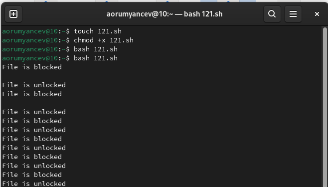
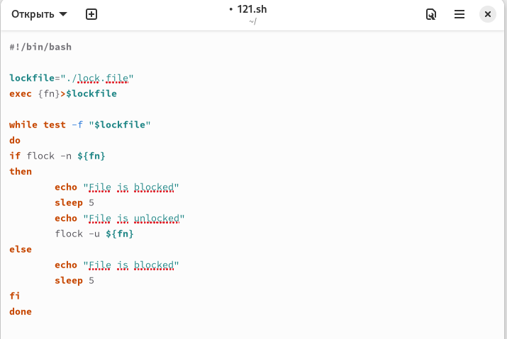
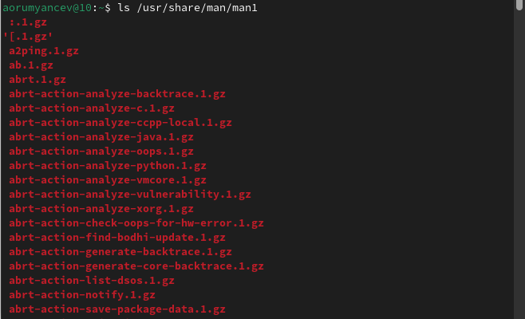
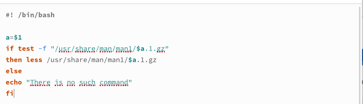
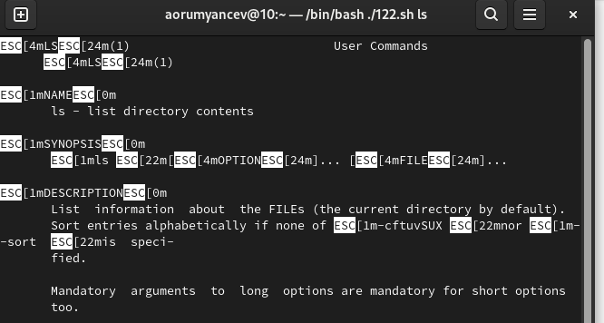
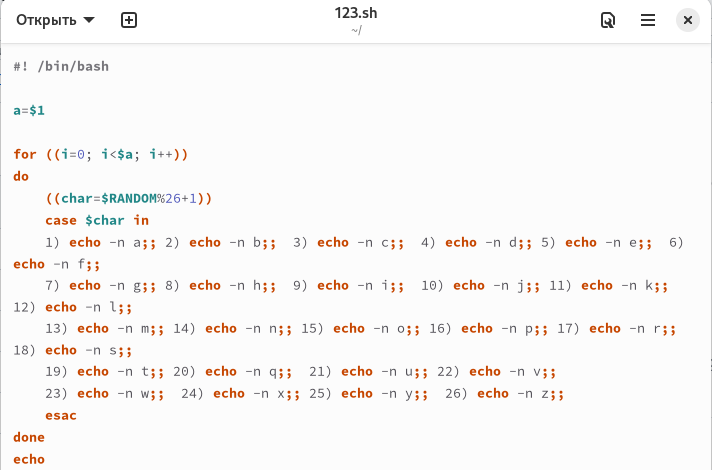

---
## Front matter
lang: ru-RU
title: Отчёт по лабораторной работе №14
subtitle: Операционные системы
author:
  - Румянцев А. О.
institute:
  - Российский университет дружбы народов, Москва, Россия
date: 10 мая 2024

## i18n babel
babel-lang: russian
babel-otherlangs: english

## Formatting pdf
toc: false
toc-title: Содержание
slide_level: 2
aspectratio: 169
section-titles: true
theme: metropolis
header-includes:
 - \metroset{progressbar=frametitle,sectionpage=progressbar,numbering=fraction}
 - '\makeatletter'
 - '\beamer@ignorenonframefalse'
 - '\makeatother'
---

# Выполнение лабораторной работы

## Создаю командный файл для первой программы, пишу её,проверяю её работу.

## Командный файл, реализующий упрощённый механизм семафоров. Командный файл должен в течение некоторого времени t1 дожидаться освобождения ресурса, выдавая об этом сообщение, а дождавшись его освобождения, использовать его в течение некоторого времени t2<>t1, также выдавая информацию о том, что ресурс используется соответствующим командным файлом (процессом). Запустить командный файл в одном виртуальном терминале в фоновом режиме, перенаправив его вывод в другой (> /dev/tty#, где # — номер терминала куда перенаправляется вывод), в котором также запущен этот файл, но не фоновом, а в привилегированном режиме. Доработать программу так, чтобы имелась возможность взаимодействия трёх и более процессов 

## Чтобы реализовать команду man с помощью командного файла, изучаю содержимое каталога /usr/share/man/man1. В нем находятся архивы текстовых файлов, содержащихсправку по большинству установленных в системе программ и команд. Каждый архив можно открыть командой less сразу же просмотрев содержимое справки

## Командный файл должен получать в виде аргумента командной строки название команды и в видe результата выдавать справку об этой команде или сообщение об отсутствии справки, если соответствующего файла нет в каталоге man1

## Проверяю работу командного файла

## Командный файл работает так же, как и команда man, открывает справку по указанной утилите

## Создаю файл для кода третьей программы, пишу программу и проверяю ее работу

## Используя встроенную переменную $RANDOM, пишу командный файл, генерирующий случайную последовательность букв латинского алфавита. Т.к. $RANDOM выдаёт псевдослучайные числа в диапазоне от 0 до 32767, ввожу ограничения так, чтобы была генерация чисел от 1 до 26

# Выводы

При выполнении данной лабораторной работы я изучила основы программирования в оболочке ОС UNIX, научилась писать более сложные командные файлы с использованием логических управляющих конструкций и циклов.

