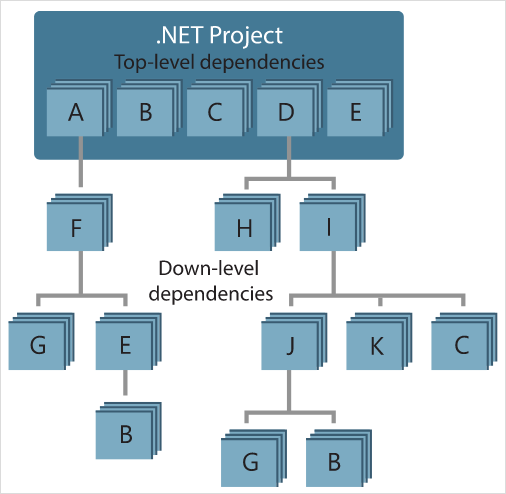

---
## Front matter
lang: ru-RU
title: Система управления пакетами NuGet
subtitle: Операционные системы 
author:
  - Румянцев А.О
institute:
  - Российский университет дружбы народов, Москва, Россия
date: 17 май 2024

## i18n babel
babel-lang: russian
babel-otherlangs: english

## Formatting pdf
toc: false
toc-title: Содержание
slide_level: 2
aspectratio: 169
section-titles: true
theme: metropolis
header-includes:
 - \metroset{progressbar=frametitle,sectionpage=progressbar,numbering=fraction}
 - '\makeatletter'
 - '\beamer@ignorenonframefalse'
 - '\makeatother'
---

# Информация

## Докладчик

  * Румянцев Артём Олегович
  * Студент НБИ-02-23
  * 1132231426@pfur.ru
  * Российский университет дружбы народов
  
  

# Введение в NuGet

## Введение в NuGet

- Ключевой инструмент для любой современной платформы разработки — это механизм, с помощью которого разработчики могут создавать, передавать друг другу и использовать полезный код. Часто такой код распределен по "пакетам", включающим скомпилированный код (в виде библиотек DLL) и другое содержимое, необходимое использующим эти пакеты проектам.
Для .NET (в том числе .NET Core) механизмом совместного использования кода, поддерживаемым Майкрософт, является NuGet, который определяет, как создаются, размещаются и используются пакеты для .NET, а также предоставляет средства для каждой из этих ролей.

## Что такое NuGet

- NuGet представляет собой отдельный ZIP-файл с расширением .nupkg, который содержит скомпилированный код (DLL), другие файлы, связанные с этим кодом, и описательный манифест, включающий такие сведения, как номер версии пакета.

## Введение в NuGet

- Разработчики, у которых есть код, к которому нужно предоставить общий доступ, создают пакеты и публикуют их на закрытых или открытых узлах. Потребители получают эти пакеты из соответствующих узлов, добавляют их в свои проекты, а затем вызывают функции пакета в коде своего проекта. При этом NuGet сам обрабатывает все промежуточные данные.

## Введение в NuGet

- Так как NuGet поддерживает закрытые узлы наряду с открытым узлом nuget.org, с помощью пакетов NuGet вы можете делиться кодом, используемым в рамках организации или рабочей группы. Пакеты NuGet также являются удобным способом факторизовать свой код для использования только в собственных проектах. Иными словами, пакет NuGet является совместно используемой единицей кода, однако не требует и не подразумевает какого-либо определенного способа предоставления общего доступа.

# Поток пакетов между создателями, узлами и потребителями

- Выполняя роль общедоступного узла, NuGet обслуживает центральный репозиторий с более чем 100 000 уникальных пакетов на сайте nuget.org. Ежедневно эти пакеты используют миллионы разработчиков .NET и .NET Core. NuGet также позволяет размещать пакеты в частном порядке в облаке (например, в Azure DevOps), в частной сети или даже в вашей локальной файловой системе. Таким образом эти пакеты доступны только тем разработчикам, у которых есть доступ к узлу, что позволяет сделать их доступными для отдельных групп потребителей.

## Поток пакетов между создателями, узлами и потребителями

- Независимо от своей природы, узел выступает в качестве точки подключения между создателями и потребителями пакета. Создатели разрабатывают полезные пакеты NuGet и публикуют их на узле. Потребители ищут полезные и совместимые пакеты на доступных узлах, скачивая эти пакеты и включая их в свои проекты.После установки в проекте API пакеты становятся доступны остальной части кода проекта.

# Совместимость пакета с разными целевыми платформами

"Совместимый" пакет означает, что он содержит сборки, созданные по меньшей мере для одной целевой платформы .NET, совместимой с целевой платформой используемого проекта.

## Совместимость пакета с разными целевыми платформами

Для максимальной совместимости пакета разработчики используют версию .NET Standard, которую поддерживают все проекты .NET и .NET Core. Это наиболее эффективное средство как для создателей, так и для потребителей, так как единый пакет (обычно содержащий единую сборку) подходит для всех потребляющих проектов.

# Управление зависимостями

- Возможность легко брать за основу работу других — это одна из наиболее мощных функций системы управления пакетами. Соответственно, значительная часть работы NuGet заключается в управлении этим деревом или "схемой" зависимостей от имени проекта. Если эти пакеты используют другие пакеты (которые, в свою очередь, также используют пакеты), все эти зависимости нижнего уровня обрабатывает NuGet.

## На рисунке показан проект, зависящий от пяти пакетов, которые, в свою очередь, зависят от нескольких других.

# Что ещё делает NuGet

Чтобы обеспечить эффективную работу процессов, NuGet осуществляет некоторые оптимизации в фоновом режиме. В частности, NuGet управляет кэшем пакета и папкой глобальных пакетов, что позволяет упростить установку и повторною установку. Кэш позволяет избежать загрузки пакета, который уже установлен на компьютере. Папка глобальных пакетов позволяет в нескольких проектах совместно использовать один установленный пакет, тем самым уменьшая общий размер пакетов NuGet на компьютере

## Что ещё делает NuGet

Кроме того, NuGet обслуживает все спецификации, связанные со структурированием пакетов (включая локализацию и отладочные символы) и ссылками на них (включая диапазоны версий и предварительные версии). NuGet также имеет различные API для программной работы со своими службами и предоставляет поддержку разработчикам, которые пишут расширения Visual Studio и шаблоны проектов.

## Источники

- https://ru.wikipedia.org/wiki/NuGet
- https://www.nuget.org/
- https://learn.microsoft.com/ru-ru/nuget/what-is-nuget

# Спасибо за внимание 

