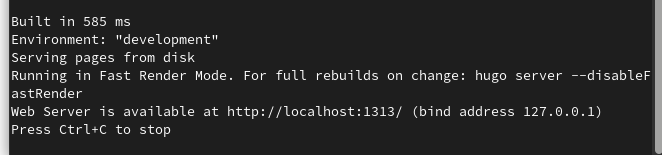
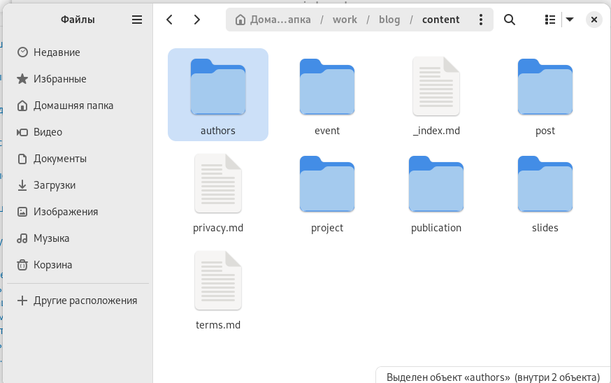
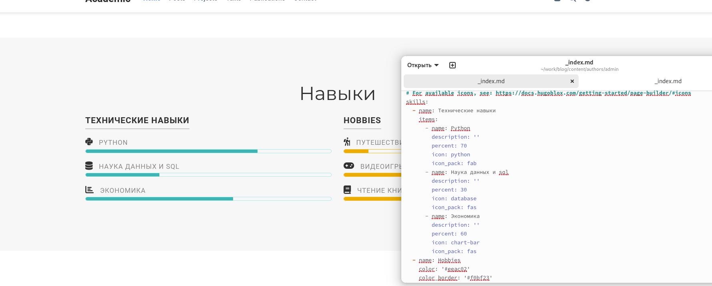
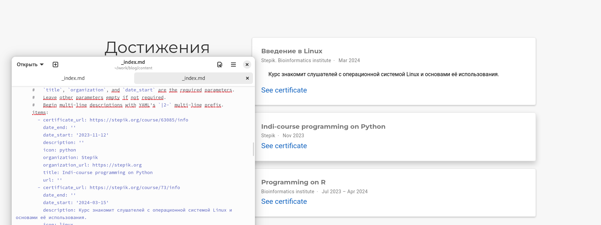
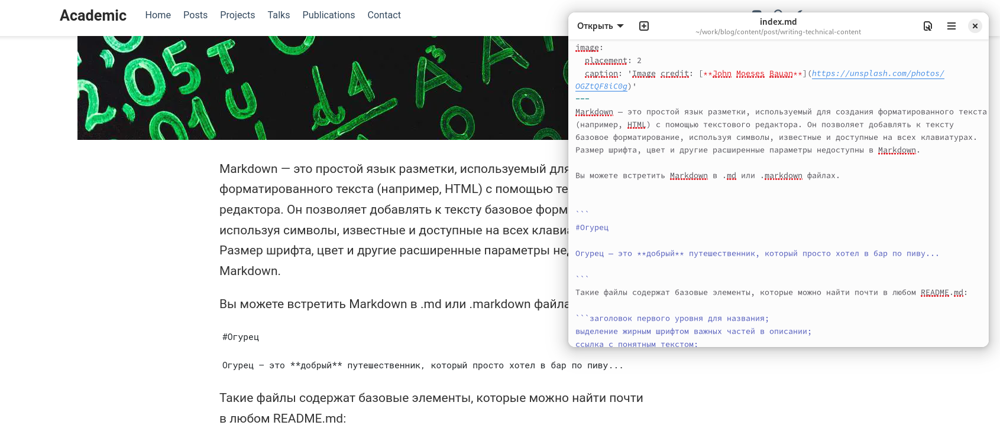
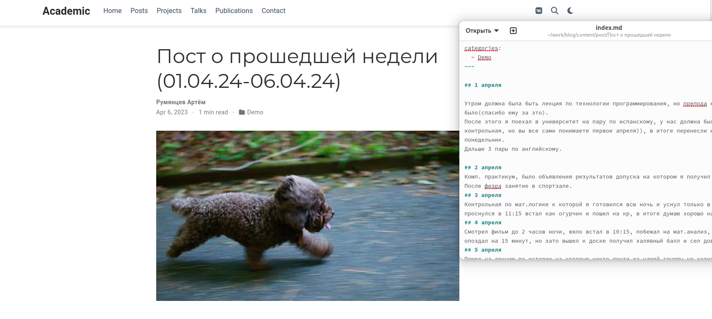
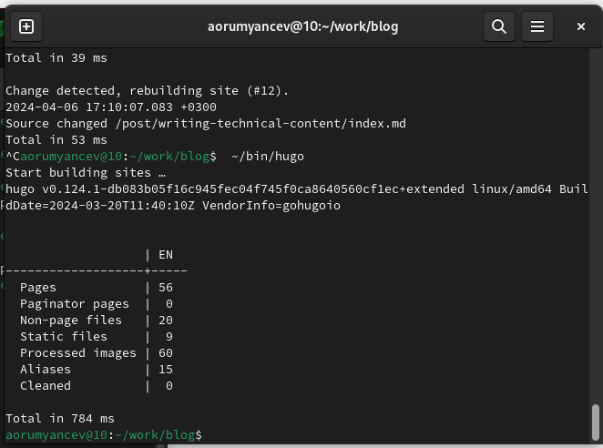
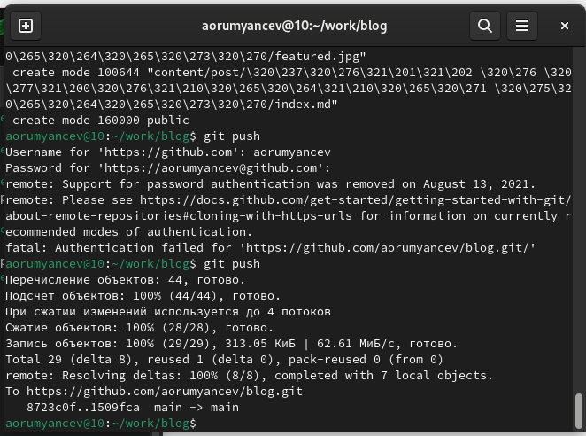

---
## Front matter
lang: ru-RU
title: Презентация по Индивидуальному проекту №3
subtitle: Операционные системы
author:
  - Румянцев А.О
institute:
  - Российский университет дружбы народов, Москва, Россия
date: 06 апреля 2024

## i18n babel
babel-lang: russian
babel-otherlangs: english

## Formatting pdf
toc: false
toc-title: Содержание
slide_level: 2
aspectratio: 169
section-titles: true
theme: metropolis
header-includes:
 - \metroset{progressbar=frametitle,sectionpage=progressbar,numbering=fraction}
 - '\makeatletter'
 - '\beamer@ignorenonframefalse'
 - '\makeatother'
---
# Цель работы

Продолжение работы со своим сайтом. Редактировать его в соответствии с требованиями. Добавить данные о своих достижениях.

# Задание

1. Добавить информацию о навыках (Skills).
2. Добавить информацию об опыте (Experience).
3. Добавить информацию о достижениях (Accomplishments).
4. Сделать пост по прошедшей неделе.
5. Добавить пост на тему по выбору

# Теоретическое введение

Hugo - генератор статических страниц для интернета.

# Выполнение проекта

## Захожу в терминал, перехожу в директорию ~/work/blog, ввожу команду ~/bin/hugo server для запуска локального сервера.

{#fig:001 width=70%}

## Перехожу в директорию ~/work/blog/content, открываю файл _index.md, в нем будет осуществляться дальнейшая работа

{#fig:001 width=70%}

## В блоке features, там где заголовок skills прописал навыки.

{#fig:001 width=70%}

## Далее добавил свой опыт в блоке Experience, указал ссылки на компании.

{#fig:001 width=70%}

## Далее в Accomplishments добавил достижения.

{#fig:001 width=70%}

## Добавил пост на тему по выбору в папке posts.

{#fig:001 width=70%}

## Добавил пост о прошедшей недели в папке posts.

{#fig:001 width=70%}

## Закрываю локальный сервер с помощью клавиш ctrl+c и собираю сайт с изменениями, введя команду ~/bin/hugo без аргументов

{#fig:001 width=70%}

## Отправляю изменение на github

{#fig:001 width=70%}

# Выводы

В процессе выполнения второго этапа индивидуального проекта я научился редактировать данные о себе, а также писать посты и добавлять их на сайт.
