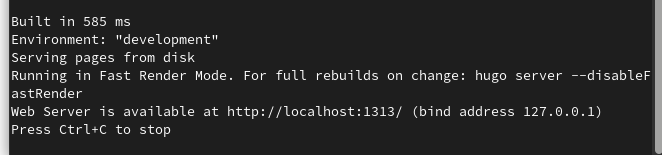
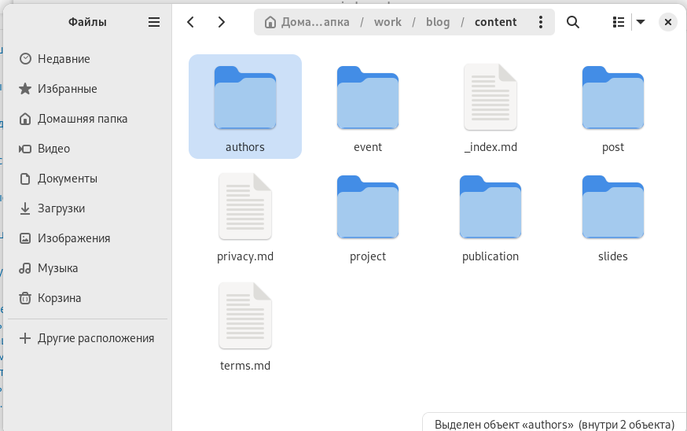
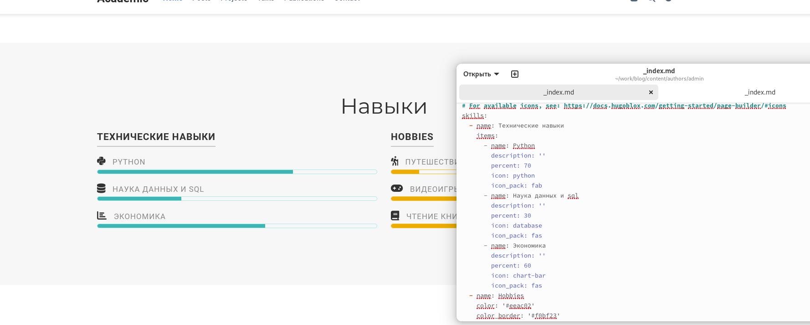
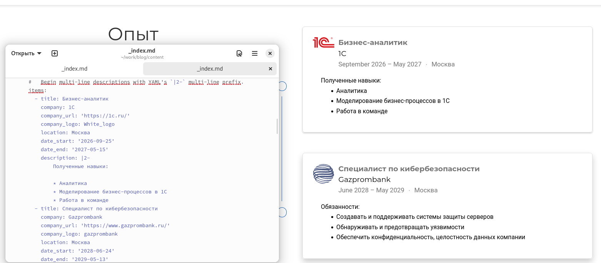
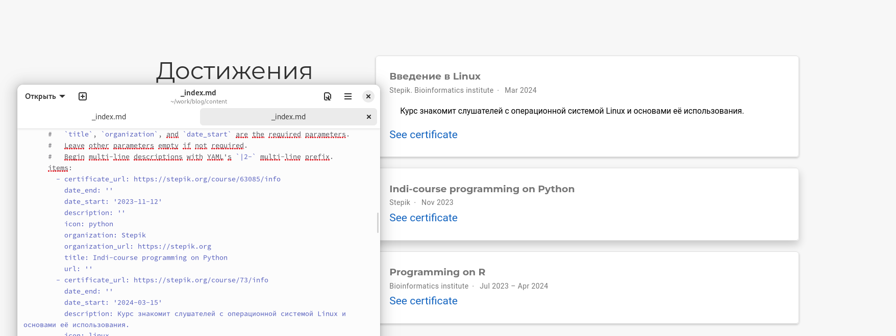
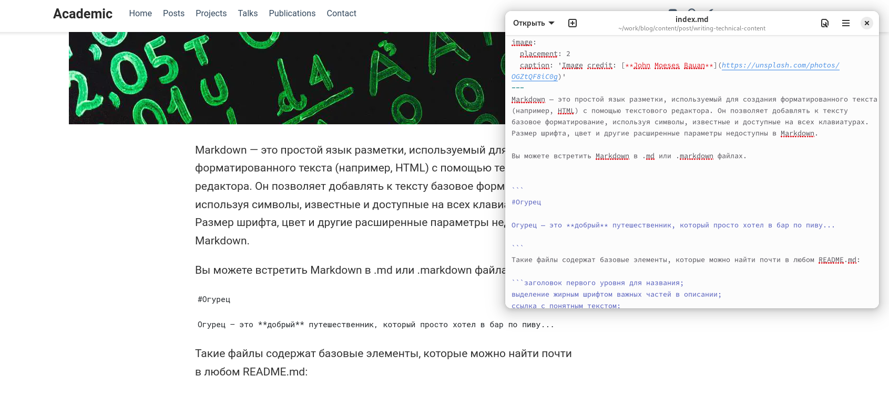
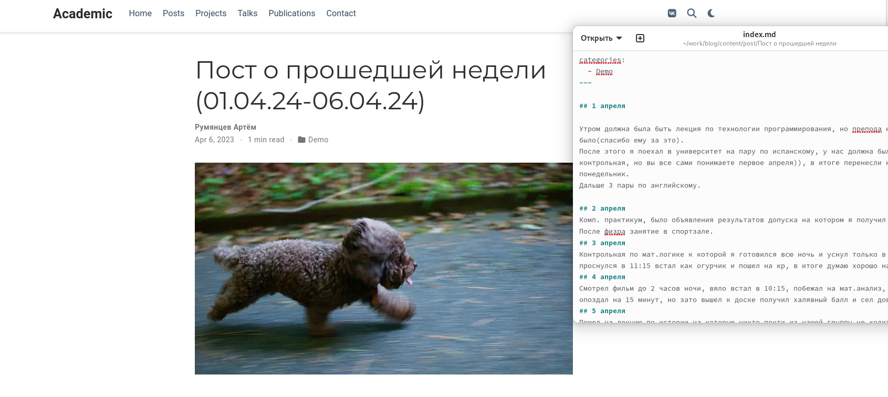
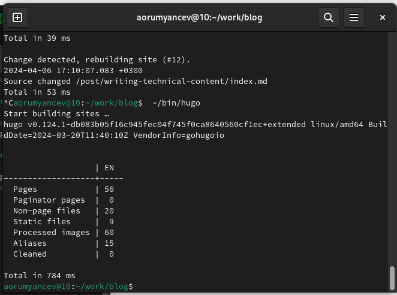
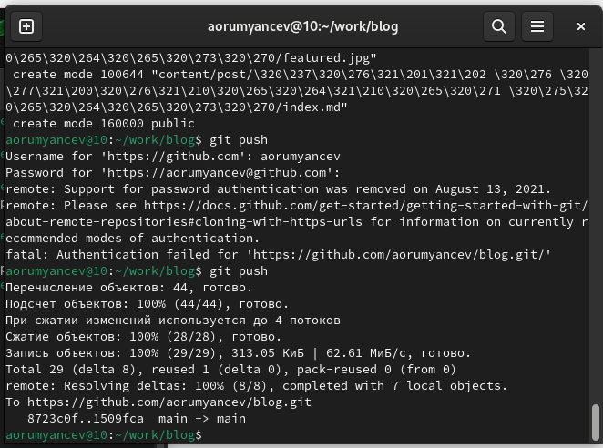

---
## Front matter
title: " Отчёта по индивидуальному проекту "
subtitle: "Операционные системы"
author: "Румянцев Артём Олегович"

## Generic otions
lang: ru-RU
toc-title: "Содержание"

## Bibliography
bibliography: bib/cite.bib
csl: pandoc/csl/gost-r-7-0-5-2008-numeric.csl

## Pdf output format
toc: true # Table of contents
toc-depth: 2
lof: true # List of figures
lot: true # List of tables
fontsize: 12pt
linestretch: 1.5
papersize: a4
documentclass: scrreprt
## I18n polyglossia
polyglossia-lang:
  name: russian
  options:
	- spelling=modern
	- babelshorthands=true
polyglossia-otherlangs:
  name: english
## I18n babel
babel-lang: russian
babel-otherlangs: english
## Fonts
mainfont: PT Serif
romanfont: PT Serif
sansfont: PT Sans
monofont: PT Mono
mainfontoptions: Ligatures=TeX
romanfontoptions: Ligatures=TeX
sansfontoptions: Ligatures=TeX,Scale=MatchLowercase
monofontoptions: Scale=MatchLowercase,Scale=0.9
## Biblatex
biblatex: true
biblio-style: "gost-numeric"
biblatexoptions:
  - parentracker=true
  - backend=biber
  - hyperref=auto
  - language=auto
  - autolang=other*
  - citestyle=gost-numeric
## Pandoc-crossref LaTeX customization
figureTitle: "Рис."
tableTitle: "Таблица"
listingTitle: "Листинг"
lofTitle: "Список иллюстраций"
lotTitle: "Список таблиц"
lolTitle: "Листинги"
## Misc options
indent: true
header-includes:
  - \usepackage{indentfirst}
  - \usepackage{float} # keep figures where there are in the text
  - \floatplacement{figure}{H} # keep figures where there are in the text
---

# Цель работы

Продолжение работы со своим сайтом. Редактировать его в соответствии с требованиями. Добавить данные о своих достижениях.

# Задание

1. Добавить информацию о навыках (Skills).
2. Добавить информацию об опыте (Experience).
3. Добавить информацию о достижениях (Accomplishments).
4. Сделать пост по прошедшей неделе.
5. Добавить пост на тему по выбору: 
# Теоретическое введение

Hugo - генератор статических страниц для интернета.

# Выполнение проекта

Захожу в терминал, перехожу в директорию ~/work/blog, ввожу команду ~/bin/hugo server для запуска локального сервера.

{#fig:001 width=70%}

Перехожу в директорию ~/work/blog/content, открываю файл _index.md, в нем будет осуществляться дальнейшая работа

{#fig:001 width=70%}

В блоке features, там где заголовок skills прописал навыки.

{#fig:001 width=70%}

Далее добавил свой опыт в блоке Experience, указал ссылки на компании.

{#fig:001 width=70%}

Далее в Accomplishments добавил достижения.

{#fig:001 width=70%}

Добавил пост на тему по выбору в папке posts.

{#fig:001 width=70%}

Добавил пост о прошедшей недели в папке posts.

{#fig:001 width=70%}

Закрываю локальный сервер с помощью клавиш ctrl+c и собираю сайт с изменениями, введя команду ~/bin/hugo без аргументов

{#fig:001 width=70%}
Отправляю изменение на github

{#fig:001 width=70%}
# Выводы

В процессе выполнения второго этапа индивидуального проекта я научился редактировать данные о себе, а также писать посты и добавлять их на сайт.
