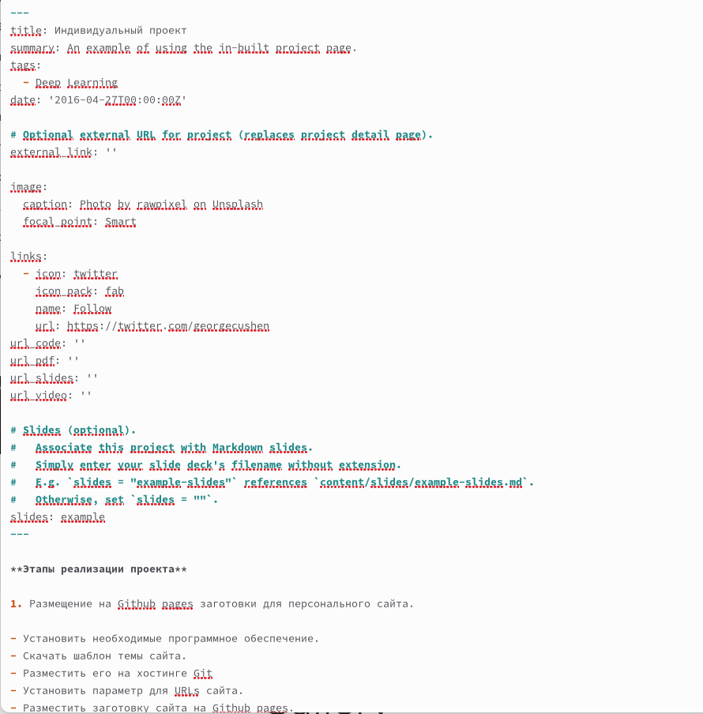
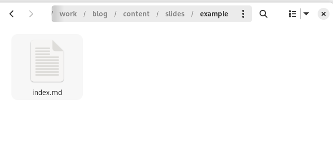
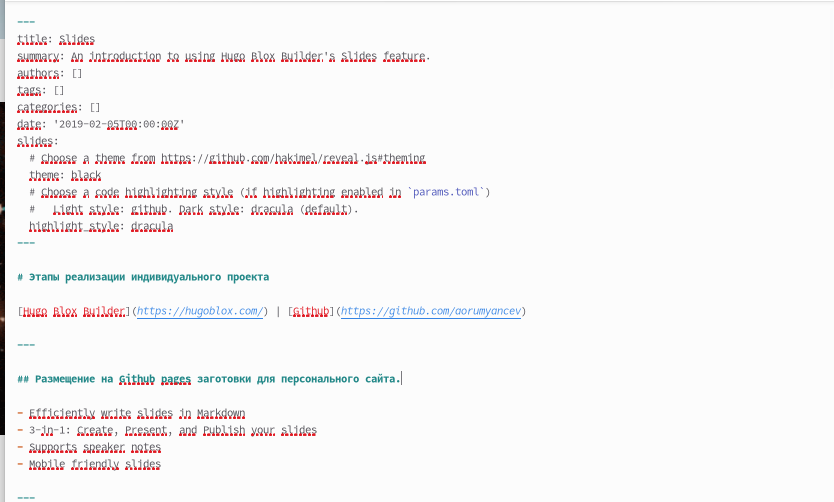
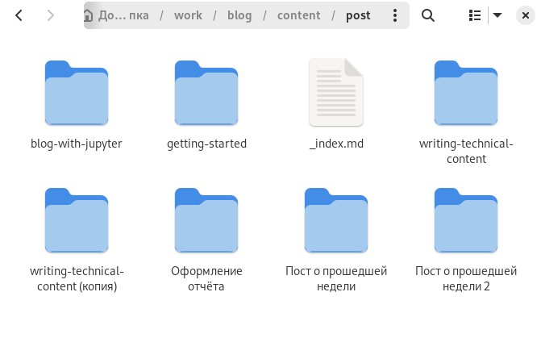
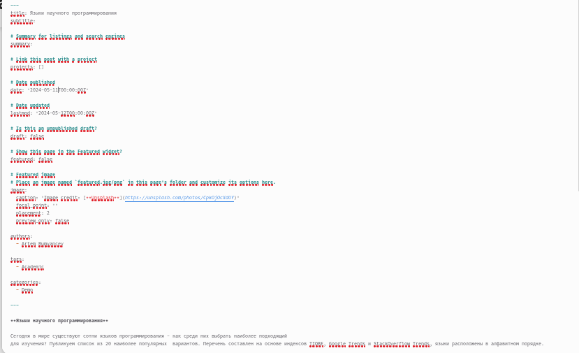
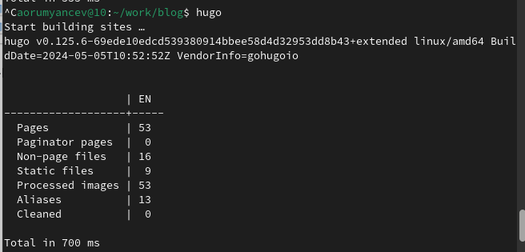
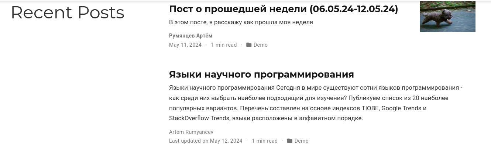
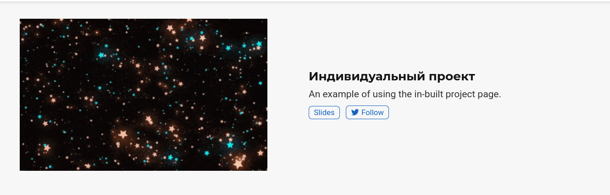
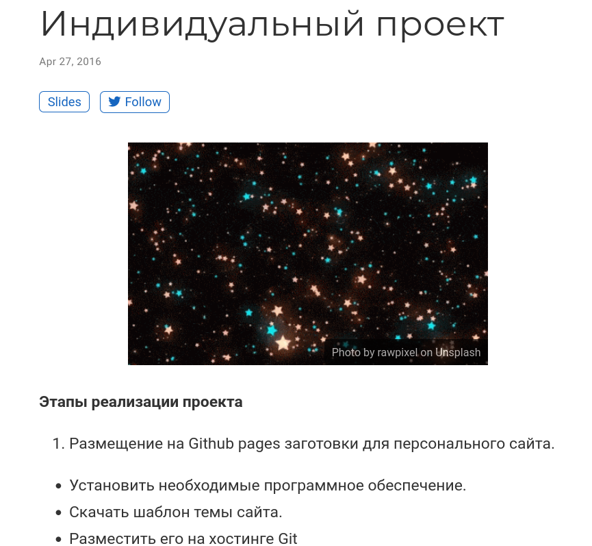

---
## Front matter
lang: ru-RU
title: Отчёт по индивидуального проекта 5 этап
subtitle: Операционные системы
author:
  - Румянцев А. О.
institute:
  - Российский университет дружбы народов, Москва, Россия
date: 12 мая 2024

## i18n babel
babel-lang: russian
babel-otherlangs: english

## Formatting pdf
toc: false
toc-title: Содержание
slide_level: 2
aspectratio: 169
section-titles: true
theme: metropolis
header-includes:
 - \metroset{progressbar=frametitle,sectionpage=progressbar,numbering=fraction}
 - '\makeatletter'
 - '\beamer@ignorenonframefalse'
 - '\makeatother'
---

# Цель работы

Добавить к сайту все остальные элементы

# Задание

1. Сделать записи для персональных проектов.
2. Сделать пост по прошедшей неделе.
3. Добавить пост на тему: "Языки научного программирования"

# Выполнение индивидуального проекта 

## Чтобы сделать записи для персональных проектов мы должны проделать данный путь: "work", "blog", "content", "project", "example". Внутри каталога "example", мы открываем файл "index.md"

## Внутри файла меняем титульное название, а также ссылку на твиттер меняем на Github. После чего добавляем этапы реализации нашего индивидуального проекта 

## После этого проделаем путь для изменения презентации в проекте "work","blog","content","slides","example". Внутри каталога "example" мы открываем файл "index.md"

## Внутри презентации добавляем тот же самый текст, который только что вносили в другой файл. А также добавляем ссылку на Github 

## Теперь создадим каталоги для наших новых постов и назовём их: "Пост о прошедшей неделе " и "Языки научного программирования". Чтобы создать эти каталоги нужно проделать следующий путь: "work", "blog", "content", "post" 

## Добавим информацию для наших постов, которую мы написали заранее 

## Чтобы вся наша информация выгрузилась на сайт, откроем в каталоге "blog" терминал и запустим команду hugo 

## Как только команда hugo выполнилась перейдём первым этапом в подкаталог "public" и проделаем указанные на скриншоте действий. Вторым этапом проделаем все те же самые действия, но уже в каталоге "blog"

	

## Последним шагом перейдём на наш сайт и посмотрим итог работы 

## 2

## 3

# Выводы

В ходе выполнения пятого этапа индивидуального проекта мы научились добавлять к сайту все остальные элементы.
