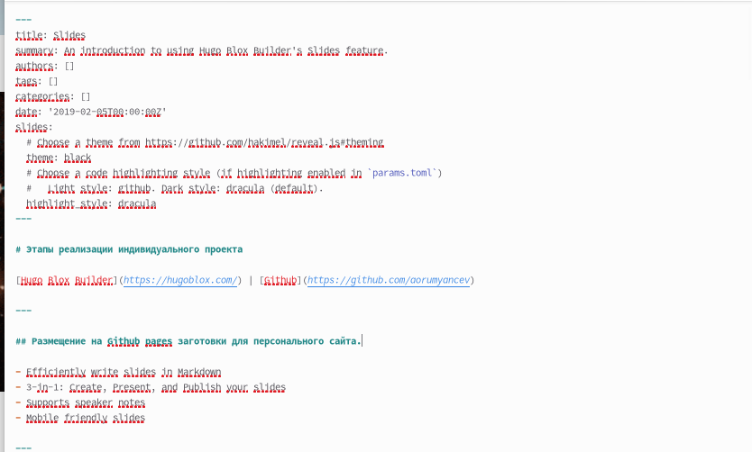
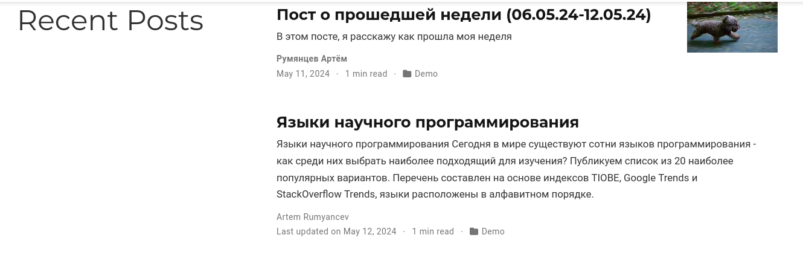

---
## Front matter
title: "Отчёт по индивидуальному проекту"
subtitle: "Операционные системы"
author: "Румянцев Артём Олегович"

## Generic otions
lang: ru-RU
toc-title: "Содержание"

## Bibliography
bibliography: bib/cite.bib
csl: pandoc/csl/gost-r-7-0-5-2008-numeric.csl

## Pdf output format
toc: true # Table of contents
toc-depth: 2
lof: true # List of figures
lot: true # List of tables
fontsize: 12pt
linestretch: 1.5
papersize: a4
documentclass: scrreprt
## I18n polyglossia
polyglossia-lang:
  name: russian
  options:
	- spelling=modern
	- babelshorthands=true
polyglossia-otherlangs:
  name: english
## I18n babel
babel-lang: russian
babel-otherlangs: english
## Fonts
mainfont: PT Serif
romanfont: PT Serif
sansfont: PT Sans
monofont: PT Mono
mainfontoptions: Ligatures=TeX
romanfontoptions: Ligatures=TeX
sansfontoptions: Ligatures=TeX,Scale=MatchLowercase
monofontoptions: Scale=MatchLowercase,Scale=0.9
## Biblatex
biblatex: true
biblio-style: "gost-numeric"
biblatexoptions:
  - parentracker=true
  - backend=biber
  - hyperref=auto
  - language=auto
  - autolang=other*
  - citestyle=gost-numeric
## Pandoc-crossref LaTeX customization
figureTitle: "Рис."
tableTitle: "Таблица"
listingTitle: "Листинг"
lofTitle: "Список иллюстраций"
lotTitle: "Список таблиц"
lolTitle: "Листинги"
## Misc options
indent: true
header-includes:
  - \usepackage{indentfirst}
  - \usepackage{float} # keep figures where there are in the text
  - \floatplacement{figure}{H} # keep figures where there are in the text
---

# Цель работы

Добавить к сайту все остальные элементы

# Задание

1. Сделать записи для персональных проектов.
2. Сделать пост по прошедшей неделе.
3. Добавить пост на тему: "Языки научного программирования"

# Выполнение индивидуального проекта 

Чтобы сделать записи для персональных проектов мы должны проделать данный путь: "work", "blog", "content", "project", "example". Внутри каталога "example", мы открываем файл "index.md"

Внутри файла меняем титульное название, а также ссылку на твиттер меняем на Github. После чего добавляем этапы реализации нашего индивидуального проекта 

После этого проделаем путь для изменения презентации в проекте "work","blog","content","slides","example".
Внутри каталога "example" мы открываем файл "index.md"

Внутри презентации добавляем тот же самый текст, который только что вносили в другой файл. А также добавляем ссылку на Github 

Теперь создадим каталоги для наших новых постов и назовём их: "Пост о прошедшей неделе " и "Языки научного программирования". Чтобы создать эти каталоги нужно проделать следующий путь: "work", "blog", "content", "post" 

Добавим информацию для наших постов, которую мы написали заранее 

Чтобы вся наша информация выгрузилась на сайт, откроем в каталоге "blog" терминал и запустим команду hugo 

Как только команда hugo выполнилась перейдём первым этапом в подкаталог "public" и проделаем указанные на скриншоте действий. Вторым этапом проделаем все те же самые действия, но уже в каталоге "blog"

	

Последним шагом перейдём на наш сайт и посмотрим итог работы 

# Выводы

В ходе выполнения пятого этапа индивидуального проекта мы научились добавлять к сайту все остальные элементы.
